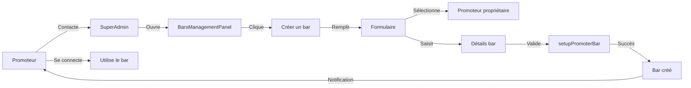
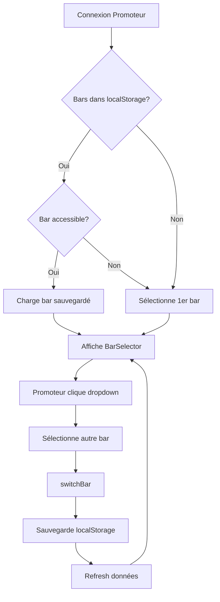

# Plan de Priorité 3 - Refactorisation SuperAdmin & Qualité du Code

## Phases implémentées

✅ **Phase 0**: Corrections Critiques (3/3 tâches)
✅ **Phase 1**: Extraction de Composants Reusables (3/3 tâches)
✅ **Phase 2**: Error Boundaries & Loading Skeletons (5/5 tâches)
✅ **Phase 3**: PromotersCreationForm Extraction (3/3 tâches)
✅ **Phase 3.1**: Auto-création de Bar (1/1 tâche)

---

# DÉCISIONS STRATÉGIQUES - Gestion des Bars

## 🎯 Phase 3.1 - Auto-création de Bar lors création Promoteur

### Implémentation ✅ COMPLÉTÉE (Commit: 32cad17)

**Modification**: `src/components/PromotersCreationForm.tsx`

**Objectif**: Utiliser les données de bar du formulaire pour créer automatiquement un bar quand le promoteur est créé

**Architecture implémentée**:
- ✅ État dédié: `promoterId`, `barCreationFailed`, `barCreationError`
- ✅ Fonction `createBar()` async avec `AuthService.setupPromoterBar()`
- ✅ Création conditionnelle: seulement si `barName.trim()` fourni
- ✅ **Graceful Degradation**: Promoteur créé même si bar échoue
- ✅ Retry Mechanism: `handleRetryBarCreation()` pour réessayer après échec
- ✅ Finish Without Bar: `handleFinishWithoutBar()` pour fermer sans bar
- ✅ Messages dynamiques: "Promoteur créé" vs "Promoteur et bar créés"
- ✅ Warning alert explicite quand bar échoue

**UX Flow**:
1. Admin remplit formulaire promoteur + bar data (optionnel)
2. Clique "Créer le promoteur"
3. Promoteur créé ✅
4. Bar création automatique si barName fourni
5. **Si bar réussit**: Success message + ferme
6. **Si bar échoue**: Warning alert + 2 options:
   - "Terminer sans bar" → Accepte et ferme
   - "Réessayer création du bar" → Retry

**Avantage**: Promoteur a un bar immédiatement, pas besoin de workflow supplémentaire

---

## 🎯 Contrôle de la création de bars (Workflow général)

### Décision validée (12 décembre 2024)

**❌ PAS d'interface "Mes bars" pour les promoteurs**

**✅ Création de bars UNIQUEMENT par le SuperAdmin**

### Justification

1. **Contrôle centralisé** : SuperAdmin garde le contrôle total sur tous les bars
2. **Sécurité** : Évite la création anarchique et les abus
3. **Simplicité** : Un seul point d'entrée, pas de workflow d'approbation complexe
4. **Gouvernance** : Validation systématique avant création
5. **Qualité** : Cohérence des données garantie

### Workflow

**Promoteur veut un nouveau bar** :
1. Promoteur contacte le SuperAdmin (email, téléphone)
2. SuperAdmin va dans `BarsManagementPanel`
3. SuperAdmin clique "Créer un bar" (futur bouton)
4. SuperAdmin sélectionne le promoteur propriétaire (dropdown)
5. SuperAdmin remplit : barName, barAddress, barPhone, settings
6. Bar créé et assigné au promoteur
7. Promoteur peut se connecter et utiliser son nouveau bar

### Phase Future (Quand nécessaire)

**Création directe de bars via BarsManagementPanel**

**Composant à créer** : `BarCreationForm.tsx`
- Dropdown : Sélectionner le promoteur propriétaire
- Champs : barName, barAddress, barPhone, settings
- Appelle : `AuthService.setupPromoterBar(selectedPromoterId, barName, settings)`
- Localisation : Bouton "Créer un bar" dans header de `BarsManagementPanel`

**Workflow**:
1. SuperAdmin clique "Créer un bar" dans BarsManagementPanel
2. Modal s'ouvre avec formulaire
3. SuperAdmin sélectionne un promoteur (dropdown)
4. SuperAdmin remplit les détails du bar
5. Bar créé et assigné au promoteur
6. Promoteur peut se connecter et utiliser son bar

**À NE PAS faire** :
- ❌ Interface "Mes bars" dans Settings pour promoteurs (self-service)
- ❌ Workflow d'approbation complexe
- ❌ Système de quotas ou limitations
- ❌ Notifications automatiques de création

---

## 🔄 Gestion multi-bars pour promoteurs

### Problématique

**Question** : Un promoteur avec plusieurs bars, vers lequel est-il redirigé après connexion ? Comment switcher entre bars ?

### Solution validée (12 décembre 2024)

**✅ Bar Selector dans le Header (Dropdown)**

### Architecture existante

Le système gère déjà les multi-bars dans `BarContext.tsx` :
- État : `currentBar`, `currentBarId`
- Fonction : `switchBar(barId)`
- Logique : Sélection automatique du premier bar accessible

### Implémentation recommandée

**Composant** : `BarSelector.tsx`

**Emplacement** : Header de l'application (à côté du nom d'utilisateur)

**Design** :
```
┌─────────────────────────────────────────────────┐
│  🏪 Bar La Concorde ▼    👤 Luc GOUNOU   🚪    │
│  ┌──────────────────────────┐                   │
│  │ ✓ Bar La Concorde        │                   │
│  │   Bar Le Palmier         │                   │
│  │   Bar L'Étoile           │                   │
│  └──────────────────────────┘                   │
└─────────────────────────────────────────────────┘
```

**Fonctionnalités** :
- Dropdown élégant avec liste des bars accessibles
- Indicateur visuel du bar actif (✓)
- Masqué si promoteur a 1 seul bar
- Persistance dans `localStorage`
- Refresh automatique des données au switch

**Workflow utilisateur** :

1. **Connexion** :
   - Système charge tous les bars du promoteur
   - Sélection automatique :
     - Si `localStorage` a un bar sauvegardé → Utilise ce bar
     - Sinon → Sélectionne le premier bar

2. **Navigation** :
   - Header affiche : `🏪 Bar La Concorde ▼`
   - Promoteur voit quel bar est actif

3. **Switch de bar** :
   - Clic sur dropdown
   - Sélection d'un autre bar
   - Application se rafraîchit avec données du nouveau bar
   - Choix sauvegardé dans `localStorage`

4. **Refresh de page** :
   - Bar sélectionné restauré depuis `localStorage`
   - Pas de perte de contexte

### Implémentation future

**Phase future : Quand le premier promoteur aura 2+ bars**

**Étapes** :
1. Créer `BarSelector.tsx` composant
2. Ajouter persistance `localStorage` dans `BarContext`
3. Intégrer dans `Header` ou `App`
4. Ajouter refresh des données au switch
5. Tester avec promoteur multi-bars

**Temps estimé** : ~2-3 heures

**Alternatives rejetées** :
- ❌ Page dédiée "Mes Bars" (navigation supplémentaire)
- ❌ Sidebar avec liste de bars (prend trop d'espace)

---

## 📊 Diagrammes de flux

### Flux de création de bar



### Flux de switch multi-bars



---

## 📈 Métriques de succès

### Objectifs quantitatifs

| Métrique | Cible | Mesure |
|----------|-------|--------|
| **Temps création bar** | < 2 min | Temps moyen SuperAdmin |
| **Temps switch bar** | < 1 sec | Latence UI + refresh |
| **Taux erreur création** | < 5% | Erreurs / Total créations |
| **Bars par promoteur** | Moyenne 1-2 | Distribution actuelle |
| **Adoption BarSelector** | 100% | Promoteurs multi-bars |

### KPIs opérationnels

- **Nombre total de bars** : Suivi mensuel
- **Bars actifs vs suspendus** : Ratio santé plateforme
- **Promoteurs multi-bars** : % du total
- **Fréquence switch** : Moyenne par promoteur/jour

---

## ❓ FAQ - Questions fréquentes

### Création de bars

**Q: Pourquoi les promoteurs ne peuvent-ils pas créer leurs propres bars ?**

R: Pour garantir le contrôle qualité, la sécurité et éviter les abus. Chaque bar représente un tenant dans notre architecture SaaS, donc nous validons chaque création.

**Q: Combien de bars un promoteur peut-il avoir ?**

R: Techniquement illimité. La base de données n'a pas de contrainte UNIQUE sur `owner_id`. En pratique, la plupart auront 1-3 bars.

**Q: Que se passe-t-il si la création du bar échoue lors de la création du promoteur ?**

R: Le promoteur est quand même créé (pas de rollback). Un message d'avertissement s'affiche avec 2 options : réessayer ou terminer sans bar. Le promoteur pourra avoir un bar créé plus tard par le SuperAdmin.

**Q: Peut-on créer un bar sans promoteur ?**

R: Non. Chaque bar doit avoir un `owner_id` (promoteur propriétaire). C'est une contrainte NOT NULL dans la base de données.

### Multi-bars

**Q: Comment un promoteur sait-il sur quel bar il travaille ?**

R: Le BarSelector dans le header affiche clairement le nom du bar actif : `🏪 Bar La Concorde ▼`

**Q: Les données sont-elles partagées entre les bars d'un même promoteur ?**

R: Non. Chaque bar est un tenant isolé. Produits, ventes, stocks sont complètement séparés.

**Q: Que se passe-t-il si je supprime le localStorage ?**

R: Au prochain chargement, le système sélectionnera automatiquement le premier bar accessible (ordre alphabétique ou date création).

**Q: Un promoteur peut-il être membre d'un bar sans en être propriétaire ?**

R: Oui ! Via la table `bar_members`, un promoteur peut avoir le rôle `gerant` sur un bar dont il n'est pas `owner_id`.

### Technique

**Q: Pourquoi utiliser localStorage et pas sessionStorage ?**

R: Pour persister le choix entre sessions. Si le promoteur ferme le navigateur et revient, il retrouve le même bar actif.

**Q: Le BarSelector fonctionne-t-il sur mobile ?**

R: Oui, le dropdown est responsive et optimisé pour mobile (touch-friendly).

**Q: Que se passe-t-il si deux onglets sont ouverts avec des bars différents ?**

R: Chaque onglet a son propre contexte React. Le localStorage est partagé, donc le dernier switch affecte tous les onglets au prochain refresh.

---

# Notes de fin de plan

Ce plan sera mis à jour au fur et à mesure des décisions stratégiques et des implémentations.

**Dernière mise à jour** : 12 décembre 2024
**Prochaine phase** : Phase 4 - BarSelector Implementation
