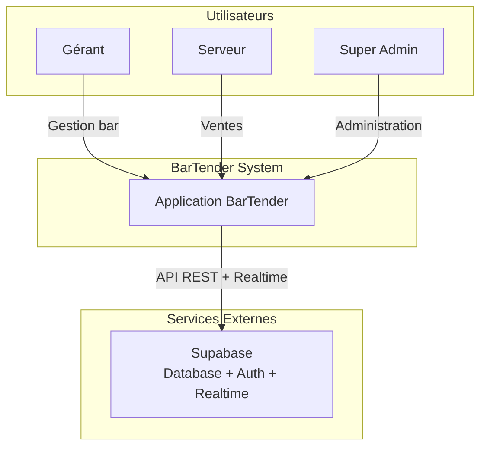
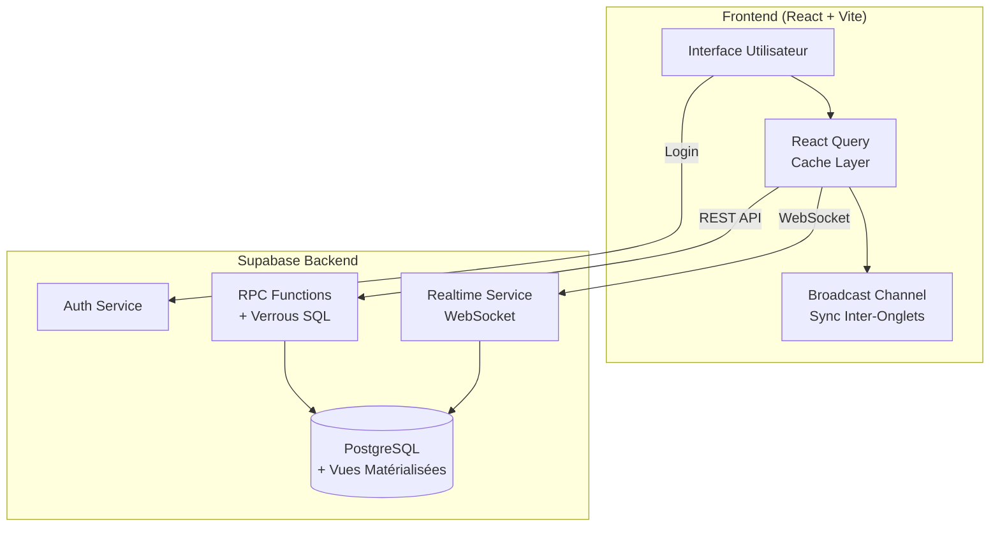
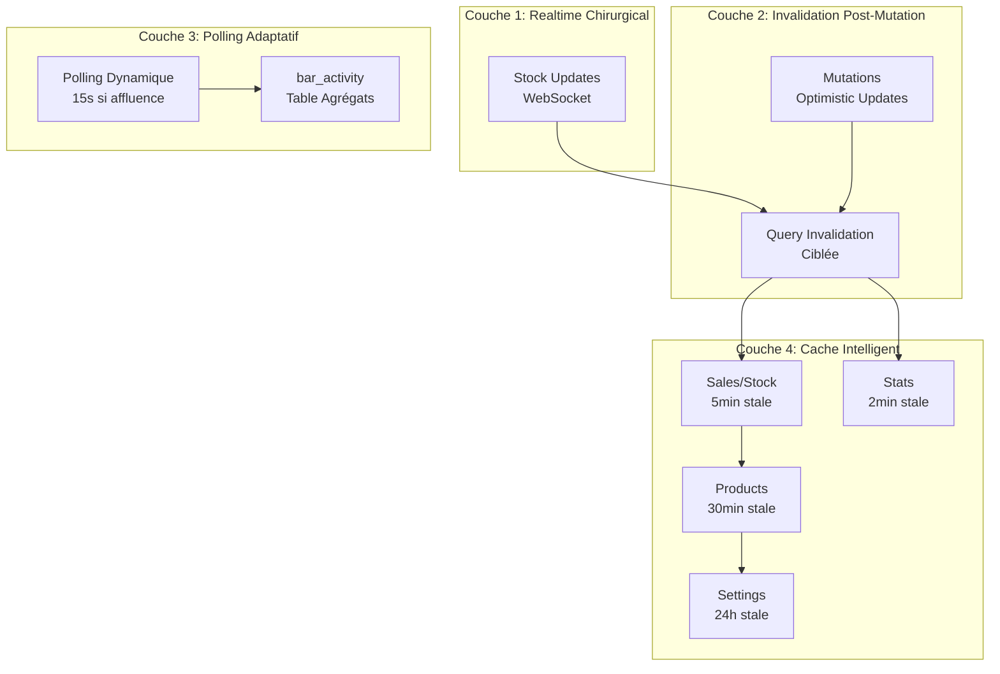
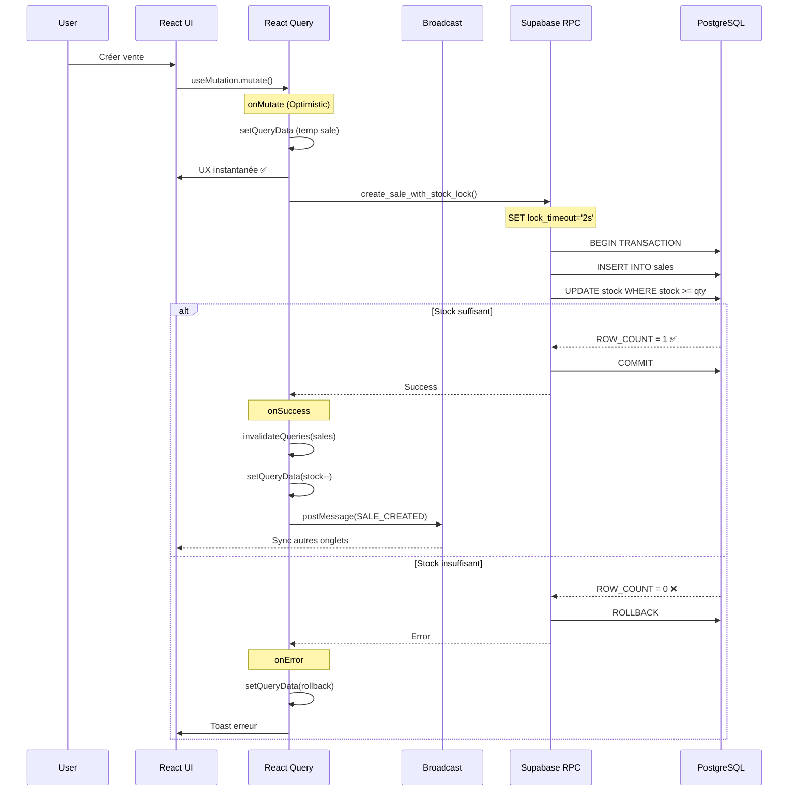

# 🚀 Plan d'Optimisation Hybride BarTender

**Objectif** : Architecture performante, scalable et économique pour production forte (100+ bars, 1000+ utilisateurs)

**Date** : 26 décembre 2025  
**Statut** : Proposition - En attente validation

---

## 📊 Résumé Exécutif

### Problème Actuel
- ❌ **Polling agressif** (2-3s) sur toutes les données
- ❌ **Coût projeté** : 442$/mois pour 100 bars
- ❌ **Risque conflits** stock (dernière bouteille)
- ❌ **Scalabilité limitée** (saturation CPU)

### Solution Proposée
- ✅ **Architecture Hybride** (Realtime + Invalidation + Polling Adaptatif + Cache)
- ✅ **Coût estimé** : 35$/mois pour 100 bars (92% d'économie)
- ✅ **Performance** : Latence < 1s sur données critiques
- ✅ **Scalabilité** : Linéaire jusqu'à 500 bars

---

## 🏗️ Architecture en 4 Couches

### Couche 1 : Realtime Chirurgical (5% du trafic)

**Données concernées** : Stock uniquement

**Pourquoi** :
- Scénario critique : 2 serveurs vendent la dernière bouteille simultanément
- Latence requise : < 500ms
- Alternative (polling 2s) : Conflit inévitable

> [!IMPORTANT]
> **Realtime seul NE suffit PAS** à éviter les conflits stock !
> 
> Realtime = synchronisation UI (notification)  
> **Verrou SQL transactionnel = vérité métier** (protection données)
> 
> Deux ventes simultanées peuvent lire `stock = 1` avant que Realtime ne notifie.

**Implémentation** :
```typescript
// hooks/queries/useStockQueries.ts
useEffect(() => {
  const subscription = supabase
    .channel(`stock:${barId}`) // ✅ Channel par bar (isolation)
    .on('postgres_changes', {
      event: 'UPDATE',
      table: 'bar_products',
      filter: `bar_id=eq.${barId}`,
    }, (payload) => {
      // Mise à jour optimiste du cache
      queryClient.setQueryData(
        stockKeys.products(barId),
        (old: Product[]) => old.map(p => 
          p.id === payload.new.id 
            ? { ...p, stock: payload.new.stock } 
            : p
        )
      );
    })
    .subscribe();

  return () => subscription.unsubscribe();
}, [barId]);
```

> [!WARNING]
> **Limite Connexions Realtime par Bar**
> 
> **Recommandation** : Max **20-30 utilisateurs simultanés/bar**
> 
> **Pourquoi** :
> - 1 bar avec 50+ users = 50+ connexions WebSocket
> - Risque : Bar "anormal" consomme trop de sockets
> - Impact : Dépassement quota Supabase (500 connexions incluses)
> 
> **Mitigation** :
> - Monitoring : Alerter si > 30 users/bar
> - Limite applicative : Bloquer nouvelles connexions si seuil atteint
> - Alternative : Passer à polling adaptatif pour bars > 30 users

**Protection SQL Obligatoire (Backend)** :
```sql
-- supabase/migrations/XXX_add_stock_transaction_lock.sql

-- Modifier la fonction de création de vente pour utiliser un verrou transactionnel
CREATE OR REPLACE FUNCTION create_sale_with_stock_lock(
  p_bar_id UUID,
  p_items JSONB,
  -- ... autres paramètres
)
RETURNS UUID
LANGUAGE plpgsql
AS $$
DECLARE
  v_sale_id UUID;
  v_item JSONB;
  v_product_id UUID;
  v_quantity INTEGER;
  v_rows_affected INTEGER;
BEGIN
  -- ✅ Protection contre blocages prolongés (saturation DB)
  SET LOCAL lock_timeout = '2s';
  SET LOCAL statement_timeout = '3s';

  -- Créer la vente
  INSERT INTO sales (bar_id, items, total, ...)
  VALUES (p_bar_id, p_items, p_total, ...)
  RETURNING id INTO v_sale_id;

  -- Décrémenter stock avec verrou atomique
  FOR v_item IN SELECT * FROM jsonb_array_elements(p_items)
  LOOP
    v_product_id := (v_item->>'product_id')::UUID;
    v_quantity := (v_item->>'quantity')::INTEGER;

    -- ✅ UPDATE atomique avec vérification stock
    UPDATE bar_products
    SET stock = stock - v_quantity
    WHERE id = v_product_id
      AND bar_id = p_bar_id
      AND stock >= v_quantity; -- Condition critique

    GET DIAGNOSTICS v_rows_affected = ROW_COUNT;

    -- ✅ Vérifier si la mise à jour a réussi
    IF v_rows_affected = 0 THEN
      -- Rollback automatique (transaction)
      RAISE EXCEPTION 'Stock insuffisant pour le produit %', v_product_id;
    END IF;
  END LOOP;

  RETURN v_sale_id;
END;
$$;
```

**Justification** :
- `UPDATE ... WHERE stock >= qty` = verrou atomique
- `ROW_COUNT = 0` = stock insuffisant (détection fiable)
- Transaction automatique = rollback si erreur
- **Realtime notifie, SQL protège**

**Coût** : 15-20$/mois (1000 users = ~1200-1500 connexions réelles avec reconnexions mobile)

---

### Couche 2 : Invalidation Post-Mutation (85% du trafic)

**Données concernées** :
- Ventes (création, validation)
- Retours (approbation, restockage)
- Approvisionnements
- Consignations

**Pourquoi** :
- UX instantanée (Optimistic Update)
- Cohérence garantie (rollback automatique)
- Pas de polling inutile

**Implémentation** :
```typescript
// hooks/mutations/useSalesMutations.ts
const createSale = useMutation({
  mutationFn: SalesService.createSale,
  
  onMutate: async (newSale) => {
    // 1. Annuler requêtes en cours
    await queryClient.cancelQueries({ queryKey: salesKeys.list(barId) });
    
    // 2. Sauvegarder état précédent
    const previous = queryClient.getQueryData(salesKeys.list(barId));
    
    // 3. Mise à jour optimiste (UX instantanée - 0 latence perçue)
    queryClient.setQueryData(salesKeys.list(barId), (old: Sale[]) => [
      ...old,
      { ...newSale, id: 'temp-' + Date.now(), status: 'pending' }
    ]);
    
    return { previous };
  },
  
  onSuccess: (data, variables) => {
    // 4. Invalidation ciblée (refetch automatique)
    queryClient.invalidateQueries({ queryKey: salesKeys.list(barId) });
    queryClient.invalidateQueries({ queryKey: statsKeys.summary(barId) });
    
    // 5. Mise à jour stock en local (éviter refetch)
    variables.items.forEach(item => {
      queryClient.setQueryData(
        stockKeys.products(barId),
        (old: Product[]) => old.map(p => 
          p.id === item.productId 
            ? { ...p, stock: p.stock - item.quantity } 
            : p
        )
      );
    });
    
    // 6. Broadcast aux autres onglets (même utilisateur)
    broadcastChannel.postMessage({ 
      type: 'SALE_CREATED', 
      barId,
      items: variables.items 
    });
  },
  
  onError: (err, newSale, context) => {
    // 7. Rollback si erreur
    queryClient.setQueryData(salesKeys.list(barId), context.previous);
    toast.error('Erreur lors de la création de la vente');
  }
});
```

**Coût** : 0$ (~3M requêtes/mois, < 5M inclus)

---

### Couche 3 : Polling Adaptatif (10% du trafic)

**Données concernées** :
- Ventes (fallback haute affluence)
- Notifications gérant

**Pourquoi** :
- Fallback si Realtime échoue (réseau instable bar)
- Activé uniquement en haute affluence (> 10 ventes/5min)
- 90% du temps : pas de polling

**Implémentation** :
```typescript
// hooks/queries/useSalesQueries.ts
const useSales = (barId: string) => {
  const [pollingInterval, setPollingInterval] = useState<false | number>(false);

  // Détection automatique affluence (optimisée)
  useEffect(() => {
    const checkTraffic = async () => {
      // ✅ Lecture O(1) depuis table agrégats (au lieu de COUNT coûteux)
      const { data } = await supabase
        .from('bar_activity')
        .select('sales_last_5min')
        .eq('bar_id', barId)
        .single();
      
      const recentSales = data?.sales_last_5min || 0;
      
      if (recentSales > 10) {
        setPollingInterval(15000); // 15s en haute affluence
      } else {
        setPollingInterval(false); // Pas de polling
      }
    };

    const interval = setInterval(checkTraffic, 60000); // Check 1×/min
    checkTraffic();
    return () => clearInterval(interval);
  }, [barId]);

  return useProxyQuery(
    salesKeys.list(barId),
    async () => { /* ... */ },
    async (userId, barIdArg) => { /* ... */ },
    {
      enabled: !!barId,
      staleTime: CACHE_STRATEGY.salesAndStock.staleTime,
      gcTime: CACHE_STRATEGY.salesAndStock.gcTime,
      refetchInterval: pollingInterval, // Dynamique
    }
  );
};
```

**Coût** : 0$ (~2M requêtes/mois, < 5M inclus)

---

### Couche 4 : Cache Intelligent

**Stratégie granulaire par type de donnée** :

| Donnée | staleTime | gcTime | Justification |
|--------|-----------|--------|---------------|
| **Ventes/Stock** | 5min | 24h | Invalidation post-mutation garantit fraîcheur |
| **Stats Journalières** | 2min | 24h | Dashboard temps réel acceptable |
| **Produits** | 30min | 24h | Catalogue quasi-statique |
| **Catégories** | 24h | 7j | Très stable |
| **Settings** | 24h | 7j | Très stable |

**Implémentation** :
```typescript
// lib/cache-strategy.ts (déjà existant - à conserver)
export const CACHE_STRATEGY = {
  salesAndStock: {
    staleTime: 5 * 60 * 1000,
    gcTime: 24 * 60 * 60 * 1000,
  },
  dailyStats: {
    staleTime: 2 * 60 * 1000,
    gcTime: 24 * 60 * 60 * 1000,
  },
  products: {
    staleTime: 30 * 60 * 1000,
    gcTime: 24 * 60 * 60 * 1000,
  },
  categories: {
    staleTime: 24 * 60 * 60 * 1000,
    gcTime: 7 * 24 * 60 * 60 * 1000,
  },
  settings: {
    staleTime: 24 * 60 * 60 * 1000,
    gcTime: 7 * 24 * 60 * 60 * 1000,
  },
};
```

**Bénéfices** :
- Taux cache hit : ~80% (réduction drastique requêtes)
- Support offline **temporaire** (session active uniquement)
- UX fluide (pas de flickering)

> [!CAUTION]
> **Limites Mode Offline**
> 
> React Query cache = **mémoire volatile** (RAM)
> - ✅ Offline temporaire : Fonctionne (perte réseau < 1h)
> - ❌ Fermeture app : Cache perdu
> - ❌ Rechargement page : Cache perdu
> 
> **Si offline critique (> 1h)** :
> - Implémenter **IndexedDB** (Dexie.js / localForage)
> - Queue de mutations persistées
> - Sync automatique au retour réseau
> 
> **Recommandation actuelle** : Offline temporaire suffisant (bars = WiFi stable)

---

## ⚙️ Optimisations Backend

### 1. Table Agrégats Temps Réel (Optimisation Polling Adaptatif)

**Problème** : `COUNT(*)` sur table `sales` volumineuse = coûteux (scan index)

**Solution** : Table d'agrégats mise à jour par trigger

```sql
-- supabase/migrations/XXX_create_bar_activity_table.sql

-- Table agrégats temps réel
CREATE TABLE IF NOT EXISTS bar_activity (
  bar_id UUID PRIMARY KEY REFERENCES bars(id) ON DELETE CASCADE,
  sales_last_5min INTEGER DEFAULT 0,
  sales_last_hour INTEGER DEFAULT 0,
  last_sale_at TIMESTAMPTZ,
  updated_at TIMESTAMPTZ DEFAULT NOW()
);

CREATE INDEX idx_bar_activity_updated ON bar_activity(updated_at);

-- Fonction de mise à jour
CREATE OR REPLACE FUNCTION update_bar_activity()
RETURNS TRIGGER AS $$
BEGIN
  -- Insérer ou mettre à jour
  INSERT INTO bar_activity (bar_id, sales_last_5min, sales_last_hour, last_sale_at)
  VALUES (
    NEW.bar_id,
    1,
    1,
    NEW.created_at
  )
  ON CONFLICT (bar_id) DO UPDATE SET
    sales_last_5min = (
      SELECT COUNT(*) FROM sales 
      WHERE bar_id = NEW.bar_id 
        AND created_at >= NOW() - INTERVAL '5 minutes'
        AND status = 'validated'
    ),
    sales_last_hour = (
      SELECT COUNT(*) FROM sales 
      WHERE bar_id = NEW.bar_id 
        AND created_at >= NOW() - INTERVAL '1 hour'
        AND status = 'validated'
    ),
    last_sale_at = NEW.created_at,
    updated_at = NOW();

  RETURN NEW;
END;
$$ LANGUAGE plpgsql;

-- Trigger sur insertion vente
CREATE TRIGGER trg_update_bar_activity
AFTER INSERT ON sales
FOR EACH ROW
EXECUTE FUNCTION update_bar_activity();

-- Nettoyage périodique (via pg_cron)
CREATE OR REPLACE FUNCTION cleanup_bar_activity()
RETURNS void AS $$
BEGIN
  UPDATE bar_activity
  SET 
    sales_last_5min = (
      SELECT COUNT(*) FROM sales 
      WHERE bar_id = bar_activity.bar_id 
        AND created_at >= NOW() - INTERVAL '5 minutes'
        AND status = 'validated'
    ),
    sales_last_hour = (
      SELECT COUNT(*) FROM sales 
      WHERE bar_id = bar_activity.bar_id 
        AND created_at >= NOW() - INTERVAL '1 hour'
        AND status = 'validated'
    );
END;
$$ LANGUAGE plpgsql;
```

**Bénéfices** :
- Lecture O(1) au lieu de COUNT runtime
- Pas de scan index sur table volumineuse
- Mise à jour automatique par trigger

---

### 2. Vues Matérialisées (pg_cron)

**Actions requises** :

#### A. Activer pg_cron (Planification Intelligente)

> [!WARNING]
> **pg_cron sur Supabase** : Quotas non documentés, jobs lourds peuvent impacter CPU.
> 
> **Recommandation** : Rafraîchir **hors heures de pointe** (18h-2h = heures bar)

```sql
-- Dans Supabase Dashboard > Database > Extensions
-- Activer pg_cron

-- Puis exécuter dans SQL Editor :

-- 1. Vues légères (toutes les heures, hors pointe)
SELECT cron.schedule(
  'refresh-light-views',
  '0 3-17 * * *', -- Toutes les heures de 3h à 17h (hors pointe bar)
  $$
    SELECT refresh_materialized_view_with_logging('daily_sales_summary', 'cron');
    SELECT refresh_materialized_view_with_logging('bars_with_stats', 'cron');
  $$
);

-- 2. Vues volumineuses (incrémentiel, 2×/jour)
SELECT cron.schedule(
  'refresh-heavy-views-incremental',
  '0 4,16 * * *', -- 4h et 16h (hors pointe)
  $$
    SELECT refresh_top_products_incremental();
    SELECT refresh_materialized_view_with_logging('product_sales_stats', 'cron');
  $$
);

-- 3. Nettoyage bar_activity (toutes les 5min)
SELECT cron.schedule(
  'cleanup-bar-activity',
  '*/5 * * * *', -- Toutes les 5min
  $$SELECT cleanup_bar_activity()$$
);
```

**Justification** :
- Heures de pointe bar : 18h-2h → éviter rafraîchissement
- Vues légères : 1×/heure hors pointe
- Vues volumineuses : 2×/jour incrémentiel
- Agrégats temps réel : 5min (léger)

#### B. Créer vue `bars_with_stats` (éliminer N+1 queries)
```sql
CREATE MATERIALIZED VIEW bars_with_stats AS
SELECT 
  b.id,
  b.name,
  b.address,
  b.phone,
  b.owner_id,
  b.created_at,
  b.is_active,
  b.closing_hour,
  b.settings,
  u.name AS owner_name,
  u.phone AS owner_phone,
  COUNT(DISTINCT bm.user_id) AS member_count
FROM bars b
LEFT JOIN users u ON u.id = b.owner_id
LEFT JOIN bar_members bm ON bm.bar_id = b.id AND bm.is_active = true
WHERE b.is_active = true
GROUP BY b.id, u.name, u.phone;

CREATE UNIQUE INDEX idx_bars_with_stats_pk ON bars_with_stats(id);
```

#### C. Rafraîchissement incrémentiel (vues volumineuses)
```sql
-- Exemple pour top_products_by_period_mat
CREATE OR REPLACE FUNCTION refresh_top_products_incremental()
RETURNS void AS $$
BEGIN
  -- Supprimer dernières 24h
  DELETE FROM top_products_by_period_mat 
  WHERE sale_date >= CURRENT_DATE - INTERVAL '1 day';
  
  -- Recalculer dernières 24h uniquement
  INSERT INTO top_products_by_period_mat
  SELECT 
    s.bar_id,
    s.business_date AS sale_date,
    -- ... (reste de la requête)
  FROM sales s
  WHERE s.business_date >= CURRENT_DATE - INTERVAL '1 day'
    AND s.status = 'validated'
  GROUP BY s.bar_id, s.business_date, product_id;
END;
$$ LANGUAGE plpgsql;
```

**Bénéfices** :
- Élimination requêtes N+1 (BarsService)
- Analytics instantanées
- Réduction charge DB

---

### 2. Indexes Stratégiques

**Indexes à ajouter** :
```sql
-- Stock (requêtes fréquentes)
CREATE INDEX CONCURRENTLY idx_bar_products_bar_stock 
ON bar_products(bar_id, stock) 
WHERE is_active = true;

-- Ventes (filtrage business_date)
CREATE INDEX CONCURRENTLY idx_sales_bar_business_date 
ON sales(bar_id, business_date DESC) 
WHERE status = 'validated';

-- Retours (jointure sale_id)
CREATE INDEX CONCURRENTLY idx_returns_sale_product 
ON returns(sale_id, product_id) 
WHERE status IN ('approved', 'restocked');

-- Bar members (requêtes fréquentes)
CREATE INDEX CONCURRENTLY idx_bar_members_user_active 
ON bar_members(user_id, bar_id) 
WHERE is_active = true;
```

**Bénéfices** :
- Accélération requêtes critiques
- Réduction CPU usage

---

### 3. Pagination Côté Serveur

**Implémentation** :
```typescript
// hooks/queries/useSalesPaginated.ts (nouveau fichier)
export const useSalesPaginated = (
  barId: string, 
  page = 1, 
  pageSize = 50
) => {
  return useQuery({
    queryKey: ['sales', 'paginated', barId, page],
    queryFn: async () => {
      const { data, count } = await supabase
        .from('sales')
        .select('*', { count: 'exact' })
        .eq('bar_id', barId)
        .order('business_date', { ascending: false })
        .range((page - 1) * pageSize, page * pageSize - 1);
      
      return { 
        sales: mapSalesData(data || []), 
        totalPages: Math.ceil((count || 0) / pageSize) 
      };
    },
    staleTime: CACHE_STRATEGY.salesAndStock.staleTime,
    keepPreviousData: true, // UX fluide changement page
  });
};
```

**Bénéfices** :
- Réduction bande passante (10 000 ventes → 50/page)
- Chargement instantané
- Scalable (100k+ ventes)

---

### 4. Broadcast Channel API (Sync Inter-Onglets)

**Implémentation** :
```typescript
// lib/broadcast.ts (nouveau fichier)
const channel = new BroadcastChannel('bartender-sync');

// Émetteur (dans mutations)
export const broadcastSaleCreated = (barId: string, items: SaleItem[]) => {
  channel.postMessage({ 
    type: 'SALE_CREATED', 
    barId,
    items 
  });
};

// Récepteur (dans App.tsx ou layout principal)
export const useBroadcastSync = () => {
  const queryClient = useQueryClient();

  useEffect(() => {
    channel.onmessage = (event) => {
      switch (event.data.type) {
        case 'SALE_CREATED':
          // Invalider cache ventes
          queryClient.invalidateQueries({ 
            queryKey: salesKeys.list(event.data.barId) 
          });
          
          // Mettre à jour stock optimiste
          event.data.items.forEach((item: SaleItem) => {
            queryClient.setQueryData(
              stockKeys.products(event.data.barId),
              (old: Product[] | undefined) => {
                if (!old) return old;
                return old.map(p => 
                  p.id === item.productId 
                    ? { ...p, stock: p.stock - item.quantity } 
                    : p
                );
              }
            );
          });
          break;
      }
    };

    return () => channel.close();
  }, [queryClient]);
};
```

**Bénéfices** :
- Synchronisation instantanée (même utilisateur, plusieurs onglets)
- Pas de requête réseau
- UX cohérente

---

## 💰 Estimation Coûts Production

### Scénario 1 : 100 bars, 1000 utilisateurs

| Composant | Volume | Coût |
|-----------|--------|------|
| **Supabase Plan Pro** | Base | 25$ |
| **Realtime Connexions** | 1000 users = ~1200-1500 connexions réelles* | 15-20$ |
| **Realtime Messages** | 20M events/mois | 0$ (illimité) |
| **DB Requêtes** | 5M/mois | 0$ (inclus) |
| **Compute** | Standard (4-core, 8GB) | 0$ (inclus) |
| **Bande passante** | 100 GB | 0$ (< 250 GB) |
| **Storage** | 50 GB | 0$ (< 100 GB) |

**TOTAL : 40-45$/mois** (vs 442$ polling actuel = **90% d'économie**)

> **Note** : *Connexions réelles > users actifs à cause de :
> - Reconnexions mobile (WiFi instable)
> - Onglets multiples (même utilisateur)
> - Doublons temporaires (transitions réseau)

---

### Scénario 2 : 500 bars, 5000 utilisateurs

| Composant | Volume | Coût |
|-----------|--------|------|
| **Supabase Plan Pro** | Base | 25$ |
| **Realtime Connexions** | 5000 users = ~6000-7500 connexions réelles | 65-75$ |
| **DB Requêtes** | 20M/mois | 7.50$ (15M extra × 0.50$/M) |
| **Compute Upgrade** | 8-core, 16GB RAM | 50$ |

**TOTAL : 147.50-157.50$/mois**

**Ratio : 0.30-0.32$/bar/mois** (très compétitif)

---

## 📊 Métriques de Performance Attendues

| Métrique | Objectif | Mesure |
|----------|----------|--------|
| **Latence Stock** | < 500ms | Realtime Supabase |
| **Latence Vente** | < 100ms | Optimistic Update |
| **Taux Cache Hit** | > 80% | React Query DevTools |
| **Conflits Stock** | 0 | Monitoring DB |
| **Uptime** | > 99.9% | Supabase SLA |
| **Coût/bar** | < 0.50$/mois | Supabase Dashboard |

---

## ⚡ Phase 4 : Performance Frontend (P1)

**Durée estimée** : 2-3 semaines | **Objectif** : Time to Interactive < 3s sur 4G

> [!NOTE]
> **Prérequis** : Phases 1-2 du Plan Finalisation Production déjà implémentées
> - ✅ Phase 1 : Consolidation & Nettoyage (dette technique résolue)
> - ✅ Phase 2 : Design System & Fondations UI (primitives UI + Storybook)

---

### 4.1 Optimisation du Bundle

**Actions** :
1. ✅ Analyser le bundle avec `rollup-plugin-visualizer` (déjà configuré)
2. ✅ Code splitting agressif : Un chunk par route principale (`React.lazy`)
3. ✅ Tree shaking : Vérifier imports partiels (lucide-react, date-fns)
4. ✅ Lazy load dépendances lourdes (`recharts`, `xlsx`) uniquement quand affichées

**Implémentation** :
```typescript
// src/App.tsx - Lazy loading routes
const SalesHistory = lazy(() => import('./pages/SalesHistory'));
const Analytics = lazy(() => import('./pages/Analytics'));
const Inventory = lazy(() => import('./pages/Inventory'));

// Lazy load recharts uniquement dans Analytics
const RechartsComponents = lazy(() => import('./components/charts/RechartsWrapper'));

// Lazy load xlsx uniquement dans ProductImport
const ExcelImport = lazy(() => import('./components/import/ExcelImport'));
```

**Validation** :
```bash
# Analyser bundle
npm run build
# Vérifier taille chunks (target: < 200KB par chunk)
```

---

### 4.2 Optimisation des Rendus React

**Actions** :
1. ✅ `React.memo()` sur composants liste purs (ex: `ProductCard`)
2. ✅ `useMemo` et `useCallback` pour calculs coûteux
3. ✅ Virtualisation : `react-window` pour listes > 100 items
4. ✅ Debounce 300ms sur inputs recherche

**Implémentation** :
```typescript
// components/ProductCard.tsx
export const ProductCard = React.memo(({ product, onSelect }) => {
  // Composant pur, re-render uniquement si props changent
  return <Card>...</Card>;
});

// hooks/useProductSearch.ts
import { useMemo } from 'react';
import { debounce } from 'lodash-es';

export const useProductSearch = (products: Product[], searchTerm: string) => {
  // Debounce recherche (300ms)
  const debouncedSearch = useMemo(
    () => debounce((term: string) => {
      // Logique de recherche
    }, 300),
    []
  );

  // Mémoriser résultats filtrés
  const filteredProducts = useMemo(() => {
    return products.filter(p => 
      p.name.toLowerCase().includes(searchTerm.toLowerCase())
    );
  }, [products, searchTerm]);

  return filteredProducts;
};

// components/SalesHistoryList.tsx - Virtualisation
import { FixedSizeList } from 'react-window';

export const SalesHistoryList = ({ sales }) => {
  return (
    <FixedSizeList
      height={600}
      itemCount={sales.length}
      itemSize={80}
      width="100%"
    >
      {({ index, style }) => (
        <div style={style}>
          <SaleCard sale={sales[index]} />
        </div>
      )}
    </FixedSizeList>
  );
};
```

**Validation** :
- React DevTools Profiler : Vérifier re-renders inutiles
- Lighthouse Performance : Score > 90

---

### 4.3 Service Worker & Offline-First

**Actions** :
1. ✅ Configurer Workbox pour caching assets statiques (`CacheFirst`)
2. ✅ Implémenter `NetworkFirst` pour appels API
3. ✅ Améliorer `SyncHandler` avec retry backoff exponentiel
4. ✅ Indicateur visuel statut offline/sync

> [!CAUTION]
> **Limites Offline**
> 
> React Query cache = **mémoire volatile** (RAM)
> - ✅ Offline temporaire : Fonctionne (perte réseau < 1h)
> - ❌ Fermeture app : Cache perdu
> - ❌ Rechargement page : Cache perdu
> 
> **Si offline critique (> 1h)** :
> - Implémenter **IndexedDB** (Dexie.js / localForage)
> - Queue mutations persistées
> - Sync automatique au retour réseau
> 
> **Recommandation actuelle** : Offline temporaire suffisant (bars = WiFi stable)

**Implémentation** :
```typescript
// vite.config.ts - Workbox
import { VitePWA } from 'vite-plugin-pwa';

export default defineConfig({
  plugins: [
    VitePWA({
      strategies: 'injectManifest',
      srcDir: 'src',
      filename: 'sw.ts',
      registerType: 'autoUpdate',
      workbox: {
        // Cache assets statiques
        runtimeCaching: [
          {
            urlPattern: /^https:\/\/fonts\.googleapis\.com\/.*/i,
            handler: 'CacheFirst',
            options: {
              cacheName: 'google-fonts-cache',
              expiration: {
                maxEntries: 10,
                maxAgeSeconds: 60 * 60 * 24 * 365, // 1 an
              },
            },
          },
          {
            urlPattern: /^https:\/\/.*\.supabase\.co\/rest\/.*/i,
            handler: 'NetworkFirst',
            options: {
              cacheName: 'supabase-api-cache',
              networkTimeoutSeconds: 10,
              expiration: {
                maxEntries: 50,
                maxAgeSeconds: 60 * 5, // 5min
              },
            },
          },
        ],
      },
    }),
  ],
});

// src/sw.ts - Service Worker custom
import { precacheAndRoute } from 'workbox-precaching';
import { registerRoute } from 'workbox-routing';
import { NetworkFirst, CacheFirst } from 'workbox-strategies';
import { BackgroundSyncPlugin } from 'workbox-background-sync';

// Precache assets
precacheAndRoute(self.__WB_MANIFEST);

// Background sync pour mutations
const bgSyncPlugin = new BackgroundSyncPlugin('mutations-queue', {
  maxRetentionTime: 24 * 60, // 24h
  onSync: async ({ queue }) => {
    let entry;
    while ((entry = await queue.shiftRequest())) {
      try {
        await fetch(entry.request.clone());
      } catch (error) {
        await queue.unshiftRequest(entry);
        throw error;
      }
    }
  },
});

// components/OfflineIndicator.tsx
export const OfflineIndicator = () => {
  const [isOnline, setIsOnline] = useState(navigator.onLine);
  const [isSyncing, setIsSyncing] = useState(false);

  useEffect(() => {
    const handleOnline = () => setIsOnline(true);
    const handleOffline = () => setIsOnline(false);

    window.addEventListener('online', handleOnline);
    window.addEventListener('offline', handleOffline);

    return () => {
      window.removeEventListener('online', handleOnline);
      window.removeEventListener('offline', handleOffline);
    };
  }, []);

  if (isOnline) return null;

  return (
    <div className="fixed top-0 left-0 right-0 bg-amber-500 text-white px-4 py-2 text-center z-50">
      {isSyncing ? '🔄 Synchronisation...' : '📡 Mode hors ligne'}
    </div>
  );
};
```

---

## 🧪 Phase 5 : Tests & Assurance Qualité (P2)

> [!IMPORTANT]
> **Phase réordonnée** : Tests après Performance Frontend pour validation technique précoce
> 
> **Avantages** :
> - ✅ Tester optimisations pendant qu'elles sont fraîches
> - ✅ Détecter bugs avant ajout UX/UI
> - ✅ Base stable pour Phase 6 (UX/UI)

**Durée estimée** : 1-2 semaines | **Impact** : Adoption et satisfaction utilisateur

---

### 5.1 Responsive Mobile Excellence

**Actions** :
1. ✅ Tester chaque page sur 320px (petits écrans)
2. ✅ Vérifier cibles tactiles ≥ 44x44px
3. ✅ Ajouter gestes tactiles (`swipe to delete`, `pull to refresh`)
4. ✅ Tester contraste en forte luminosité

**Implémentation** :
```typescript
// hooks/useSwipeToDelete.ts
import { useSwipeable } from 'react-swipeable';

export const useSwipeToDelete = (onDelete: () => void) => {
  const handlers = useSwipeable({
    onSwipedLeft: () => {
      if (window.confirm('Supprimer cet élément ?')) {
        onDelete();
      }
    },
    trackMouse: false,
    trackTouch: true,
  });

  return handlers;
};

// components/SaleCard.tsx
export const SaleCard = ({ sale, onDelete }) => {
  const swipeHandlers = useSwipeToDelete(() => onDelete(sale.id));

  return (
    <div {...swipeHandlers} className="min-h-[44px] min-w-[44px]">
      {/* Contenu */}
    </div>
  );
};
```

**Validation** :
- Tester sur iPhone SE (375px), Android (360px)
- Vérifier contraste WCAG AA (ratio ≥ 4.5:1)

---

### 5.2 Micro-interactions & Feedback

**Actions** :
1. ✅ **Loading states** : Skeleton loaders (`react-loading-skeleton`)
2. ✅ **Success feedback** : Animations + toast non-bloquant
3. ✅ **Error states** : Messages clairs + action récupération
4. ✅ **Empty states** : Illustrations + CTA clairs

**Implémentation** :
```typescript
// components/ProductListSkeleton.tsx
import Skeleton from 'react-loading-skeleton';
import 'react-loading-skeleton/dist/skeleton.css';

export const ProductListSkeleton = () => (
  <div className="grid grid-cols-2 md:grid-cols-4 gap-4">
    {Array.from({ length: 8 }).map((_, i) => (
      <div key={i} className="p-4 border rounded">
        <Skeleton height={120} />
        <Skeleton count={2} className="mt-2" />
      </div>
    ))}
  </div>
);

// components/EmptyState.tsx
export const EmptyState = ({ 
  icon: Icon, 
  title, 
  description, 
  action 
}) => (
  <div className="flex flex-col items-center justify-center py-12 text-center">
    <Icon className="w-16 h-16 text-gray-400 mb-4" />
    <h3 className="text-lg font-semibold text-gray-900 mb-2">{title}</h3>
    <p className="text-gray-600 mb-6 max-w-md">{description}</p>
    {action && (
      <button className="btn-primary">{action.label}</button>
    )}
  </div>
);

// Usage
<EmptyState
  icon={Package}
  title="Aucun produit trouvé"
  description="Commencez par ajouter des produits à votre inventaire"
  action={{ label: 'Ajouter un produit', onClick: () => {} }}
/>
```

---

### 5.3 Accessibilité (A11y)

**Actions** :
1. ✅ Attributs ARIA sur composants interactifs
2. ✅ Contraste couleurs WCAG AA
3. ✅ Navigation clavier fluide
4. ✅ Labels sémantiques sur formulaires

**Implémentation** :
```typescript
// components/ui/Button.tsx
export const Button = ({ 
  children, 
  onClick, 
  disabled,
  ariaLabel 
}) => (
  <button
    onClick={onClick}
    disabled={disabled}
    aria-label={ariaLabel}
    aria-disabled={disabled}
    className="btn"
  >
    {children}
  </button>
);

// components/SearchInput.tsx
export const SearchInput = ({ value, onChange }) => (
  <div>
    <label htmlFor="search-input" className="sr-only">
      Rechercher un produit
    </label>
    <input
      id="search-input"
      type="search"
      value={value}
      onChange={onChange}
      aria-label="Rechercher un produit"
      className="input"
    />
  </div>
);
```

**Validation** :
- Lighthouse Accessibility : Score > 95
- Test navigation clavier (Tab, Enter, Esc)
- Test lecteur d'écran (NVDA/JAWS)

---

**Durée estimée** : 2 semaines | **Objectif** : 80% coverage sur chemins critiques

---

### 5.1 Stratégie de Tests

| Type | Outils | Cibles | Coverage |
|------|--------|--------|----------|
| **Unitaire** | Vitest | Hooks métier, services, utils | 80% |
| **Intégration** | Testing Library | Flux complets (vente, retour) | 70% |
| **E2E** | Playwright | Scénarios critiques bout en bout | 50% |
| **Charge** | k6 | Performance haute affluence | - |

---

### 5.2 Tests Prioritaires

**A. Tests Unitaires (Vitest)**
```typescript
// tests/hooks/useStockManagement.test.ts
import { renderHook, act } from '@testing-library/react';
import { useStockManagement } from '@/hooks/useStockManagement';

describe('useStockManagement', () => {
  it('should decrement stock on sale', async () => {
    const { result } = renderHook(() => useStockManagement('bar-id'));
    
    await act(async () => {
      await result.current.decrementStock('product-id', 5);
    });
    
    expect(result.current.stock).toBe(95); // Assuming initial stock = 100
  });

  it('should throw error if stock insufficient', async () => {
    const { result } = renderHook(() => useStockManagement('bar-id'));
    
    await expect(
      result.current.decrementStock('product-id', 200)
    ).rejects.toThrow('Stock insuffisant');
  });
});

// tests/services/SalesService.test.ts
describe('SalesService', () => {
  it('should create sale with stock lock', async () => {
    const sale = await SalesService.createSale({
      barId: 'bar-id',
      items: [{ productId: 'p1', quantity: 2 }],
      total: 2000,
    });
    
    expect(sale.id).toBeDefined();
    expect(sale.status).toBe('pending');
  });
});
```

**B. Tests Intégration (Testing Library)**
```typescript
// tests/flows/SaleFlow.test.tsx
import { render, screen, fireEvent } from '@testing-library/react';
import { App } from '@/App';

describe('Sale Flow', () => {
  it('should complete full sale flow', async () => {
    render(<App />);
    
    // 1. Ajouter produit au panier
    fireEvent.click(screen.getByText('Heineken'));
    expect(screen.getByText('1 article')).toBeInTheDocument();
    
    // 2. Valider vente
    fireEvent.click(screen.getByText('Valider'));
    
    // 3. Vérifier confirmation
    await screen.findByText('Vente validée');
    
    // 4. Vérifier stock décrémenté
    expect(screen.getByText('Stock: 99')).toBeInTheDocument();
  });
});
```

**C. Tests E2E (Playwright)**
```typescript
// tests/e2e/critical-flows.spec.ts
import { test, expect } from '@playwright/test';

test('complete sale flow with stock update', async ({ page }) => {
  await page.goto('http://localhost:5173');
  
  // Login
  await page.fill('[name="email"]', 'test@bar.com');
  await page.fill('[name="password"]', 'password');
  await page.click('button[type="submit"]');
  
  // Add product to cart
  await page.click('text=Heineken');
  await expect(page.locator('.cart-count')).toHaveText('1');
  
  // Checkout
  await page.click('text=Valider');
  await expect(page.locator('.toast-success')).toBeVisible();
  
  // Verify stock in database
  const stock = await page.evaluate(async () => {
    const res = await fetch('/api/products/heineken');
    const data = await res.json();
    return data.stock;
  });
  expect(stock).toBe(99);
});
```

---

### 5.3 Tests RLS Automatisés (CRITIQUE)

**Implémentation** :
```sql
-- supabase/tests/rls_test_suite.sql

-- 1. Setup: créer utilisateurs de test
CREATE OR REPLACE FUNCTION create_test_user(
  p_email TEXT,
  p_role TEXT,
  p_bar_id UUID
) RETURNS UUID AS $$
DECLARE
  v_user_id UUID;
BEGIN
  INSERT INTO auth.users (email, role)
  VALUES (p_email, p_role)
  RETURNING id INTO v_user_id;
  
  INSERT INTO bar_members (user_id, bar_id, role)
  VALUES (v_user_id, p_bar_id, p_role);
  
  RETURN v_user_id;
END;
$$ LANGUAGE plpgsql;

-- 2. Tests positifs
DO $$
DECLARE
  v_serveur_id UUID;
  v_bar_id UUID := 'test-bar-1';
BEGIN
  v_serveur_id := create_test_user('serveur@test.com', 'serveur', v_bar_id);
  
  -- Serveur peut lire ventes de son bar
  SET LOCAL role TO 'authenticated';
  SET LOCAL request.jwt.claims TO json_build_object('sub', v_serveur_id)::text;
  
  PERFORM * FROM sales WHERE bar_id = v_bar_id;
  RAISE NOTICE 'Test passed: Serveur can read sales';
  
  -- Serveur peut créer vente
  INSERT INTO sales (bar_id, total, sold_by)
  VALUES (v_bar_id, 1000, v_serveur_id);
  RAISE NOTICE 'Test passed: Serveur can create sale';
END;
$$;

-- 3. Tests négatifs
DO $$
DECLARE
  v_serveur_id UUID;
  v_other_bar_id UUID := 'test-bar-2';
BEGIN
  SET LOCAL role TO 'authenticated';
  SET LOCAL request.jwt.claims TO json_build_object('sub', v_serveur_id)::text;
  
  -- Serveur ne peut PAS lire ventes d'un autre bar
  BEGIN
    PERFORM * FROM sales WHERE bar_id = v_other_bar_id;
    RAISE EXCEPTION 'Test failed: Serveur should not read other bar sales';
  EXCEPTION WHEN insufficient_privilege THEN
    RAISE NOTICE 'Test passed: Serveur cannot read other bar sales';
  END;
END;
$$;
```

**Intégration CI** :
```yaml
# .github/workflows/test.yml
name: Tests

on: [push, pull_request]

jobs:
  test:
    runs-on: ubuntu-latest
    steps:
      - uses: actions/checkout@v3
      
      # Tests RLS
      - name: Run RLS tests
        run: |
          psql $DATABASE_URL -f supabase/tests/rls_test_suite.sql
      
      # Tests unitaires
      - name: Run unit tests
        run: npm run test
      
      # Tests E2E
      - name: Run E2E tests
        run: npx playwright test
```

---

## 🎨 Phase 6 : Excellence UX/UI (P1)

**Durée estimée** : 1-2 semaines | **Impact** : Adoption et satisfaction utilisateur

> [!NOTE]
> **Phase réordonnée** : UX/UI après Tests pour polish sur base technique validée

---

### 6.1 Responsive Mobile Excellence

**Actions** :
1. ✅ Tester chaque page sur 320px (petits écrans)
2. ✅ Vérifier cibles tactiles ≥ 44x44px
3. ✅ Ajouter gestes tactiles (`swipe to delete`, `pull to refresh`)
4. ✅ Tester contraste en forte luminosité

**Implémentation** :
```typescript
// hooks/useSwipeToDelete.ts
import { useSwipeable } from 'react-swipeable';

export const useSwipeToDelete = (onDelete: () => void) => {
  const handlers = useSwipeable({
    onSwipedLeft: () => {
      if (window.confirm('Supprimer cet élément ?')) {
        onDelete();
      }
    },
    trackMouse: false,
    trackTouch: true,
  });

  return handlers;
};

// components/SaleCard.tsx
export const SaleCard = ({ sale, onDelete }) => {
  const swipeHandlers = useSwipeToDelete(() => onDelete(sale.id));

  return (
    <div {...swipeHandlers} className="min-h-[44px] min-w-[44px]">
      {/* Contenu */}
    </div>
  );
};
```

**Validation** :
- Tester sur iPhone SE (375px), Android (360px)
- Vérifier contraste WCAG AA (ratio ≥ 4.5:1)

---

### 6.2 Micro-interactions & Feedback

**Actions** :
1. ✅ **Loading states** : Skeleton loaders (`react-loading-skeleton`)
2. ✅ **Success feedback** : Animations + toast non-bloquant
3. ✅ **Error states** : Messages clairs + action récupération
4. ✅ **Empty states** : Illustrations + CTA clairs

**Implémentation** :
```typescript
// components/ProductListSkeleton.tsx
import Skeleton from 'react-loading-skeleton';
import 'react-loading-skeleton/dist/skeleton.css';

export const ProductListSkeleton = () => (
  <div className="grid grid-cols-2 md:grid-cols-4 gap-4">
    {Array.from({ length: 8 }).map((_, i) => (
      <div key={i} className="p-4 border rounded">
        <Skeleton height={120} />
        <Skeleton count={2} className="mt-2" />
      </div>
    ))}
  </div>
);

// components/EmptyState.tsx
export const EmptyState = ({ 
  icon: Icon, 
  title, 
  description, 
  action 
}) => (
  <div className="flex flex-col items-center justify-center py-12 text-center">
    <Icon className="w-16 h-16 text-gray-400 mb-4" />
    <h3 className="text-lg font-semibold text-gray-900 mb-2">{title}</h3>
    <p className="text-gray-600 mb-6 max-w-md">{description}</p>
    {action && (
      <button className="btn-primary">{action.label}</button>
    )}
  </div>
);

// Usage
<EmptyState
  icon={Package}
  title="Aucun produit trouvé"
  description="Commencez par ajouter des produits à votre inventaire"
  action={{ label: 'Ajouter un produit', onClick: () => {} }}
/>
```

---

### 6.3 Accessibilité (A11y)

**Actions** :
1. ✅ Attributs ARIA sur composants interactifs
2. ✅ Contraste couleurs WCAG AA
3. ✅ Navigation clavier fluide
4. ✅ Labels sémantiques sur formulaires

**Implémentation** :
```typescript
// components/ui/Button.tsx
export const Button = ({ 
  children, 
  onClick, 
  disabled,
  ariaLabel 
}) => (
  <button
    onClick={onClick}
    disabled={disabled}
    aria-label={ariaLabel}
    aria-disabled={disabled}
    className="btn"
  >
    {children}
  </button>
);

// components/SearchInput.tsx
export const SearchInput = ({ value, onChange }) => (
  <div>
    <label htmlFor="search-input" className="sr-only">
      Rechercher un produit
    </label>
    <input
      id="search-input"
      type="search"
      value={value}
      onChange={onChange}
      aria-label="Rechercher un produit"
      className="input"
    />
  </div>
);
```

**Validation** :
- Lighthouse Accessibility : Score > 95
- Test navigation clavier (Tab, Enter, Esc)
- Test lecteur d'écran (NVDA/JAWS)

---

## 📊 Phase 7 : Scalabilité & Monitoring (P3)

**Durée estimée** : 1-2 semaines | **Capacité cible** : 100+ bars simultanés

---

### 7.1 Observabilité Production

**A. Sentry (Error Tracking)**
```typescript
// src/main.tsx
import * as Sentry from '@sentry/react';

Sentry.init({
  dsn: import.meta.env.VITE_SENTRY_DSN,
  environment: import.meta.env.MODE,
  integrations: [
    new Sentry.BrowserTracing(),
    new Sentry.Replay(),
  ],
  tracesSampleRate: 0.1,
  replaysSessionSampleRate: 0.1,
  replaysOnErrorSampleRate: 1.0,
});
```

**B. Analytics Custom**
```typescript
// lib/analytics.ts
export const trackEvent = (event: string, properties?: Record<string, any>) => {
  // Table Supabase pour événements métier
  supabase.from('analytics_events').insert({
    event_name: event,
    properties,
    user_id: currentSession?.userId,
    bar_id: currentBar?.id,
    created_at: new Date(),
  });
};

// Usage
trackEvent('sale_created', { total: 1000, items: 3 });
trackEvent('product_low_stock', { productId: 'p1', stock: 2 });
```

**C. Performance Monitoring (Web Vitals)**
```typescript
// src/main.tsx
import { onCLS, onFID, onLCP } from 'web-vitals';

onCLS(console.log);
onFID(console.log);
onLCP(console.log);
```

---

### 7.2 Dashboard Admin Monitoring

**Implémentation** :
```typescript
// pages/admin/Monitoring.tsx
export const MonitoringDashboard = () => {
  const { data: viewMetrics } = useQuery({
    queryKey: ['materialized-view-metrics'],
    queryFn: async () => {
      const { data } = await supabase
        .from('materialized_view_metrics')
        .select('*');
      return data;
    },
  });

  return (
    <div className="space-y-6">
      <h1>Monitoring Production</h1>
      
      {/* État vues matérialisées */}
      <Card>
        <h2>Vues Matérialisées</h2>
        <table>
          <thead>
            <tr>
              <th>Vue</th>
              <th>Dernier Refresh</th>
              <th>Durée (ms)</th>
              <th>Lignes</th>
            </tr>
          </thead>
          <tbody>
            {viewMetrics?.map(view => (
              <tr key={view.view_name}>
                <td>{view.view_name}</td>
                <td>{formatDate(view.last_successful_refresh)}</td>
                <td>{view.avg_duration_ms}</td>
                <td>{view.current_row_count}</td>
              </tr>
            ))}
          </tbody>
        </table>
      </Card>
      
      {/* Métriques Supabase */}
      <Card>
        <h2>Quotas Supabase</h2>
        <div className="grid grid-cols-3 gap-4">
          <MetricCard 
            label="Requêtes DB" 
            value="3.2M / 5M" 
            percentage={64} 
          />
          <MetricCard 
            label="Connexions Realtime" 
            value="320 / 500" 
            percentage={64} 
          />
          <MetricCard 
            label="Storage" 
            value="45 GB / 100 GB" 
            percentage={45} 
          />
        </div>
      </Card>
    </div>
  );
};
```

---

### 7.3 Préparation Multi-Tenant Grande Échelle

**A. Connection Pooling (PgBouncer)**
```sql
-- Supabase Dashboard > Settings > Database
-- Activer PgBouncer (mode transaction)
-- Connection string: postgresql://postgres.xxx:6543/postgres
```

**B. CDN pour Assets**
```typescript
// Upload images via Supabase Storage
const { data } = await supabase.storage
  .from('product-images')
  .upload(`${barId}/${productId}.jpg`, file, {
    cacheControl: '3600',
    upsert: true,
  });

// URL avec CDN automatique
const imageUrl = supabase.storage
  .from('product-images')
  .getPublicUrl(`${barId}/${productId}.jpg`).data.publicUrl;
```

**C. Rate Limiting (Vercel)**
```typescript
// middleware.ts
import { Ratelimit } from '@upstash/ratelimit';
import { Redis } from '@upstash/redis';

const ratelimit = new Ratelimit({
  redis: Redis.fromEnv(),
  limiter: Ratelimit.slidingWindow(10, '10 s'),
});

export async function middleware(request: Request) {
  const ip = request.headers.get('x-forwarded-for');
  const { success } = await ratelimit.limit(ip);
  
  if (!success) {
    return new Response('Too Many Requests', { status: 429 });
  }
}
```

---

## 🚀 Plan de Migration Complet

### **Durée Totale : 6-9 semaines**

> [!NOTE]
> **Phases 1-2 déjà implémentées** ✅
> - Phase 1 : Consolidation & Nettoyage
> - Phase 2 : Design System & Fondations UI

---

### Phase 3 : Optimisation Supabase (5-6 jours)

**Objectif** : Performance + Économie + Scalabilité + Sécurité

> [!IMPORTANT]
> **Ajustements suite retour d'expert** (95/100 → 98-99/100)
> - ✅ Monitoring RLS runtime (sécurité)
> - ✅ Garde-fous pg_cron (stabilité)
> - ✅ Fallback polling > 30 users/bar (scalabilité)
> - ✅ Tests edge cases (robustesse)

#### Jour 1 : Préparation Backend
- [ ] Activer pg_cron (Supabase Dashboard)
- [ ] Créer table `bar_activity` + trigger
- [ ] Créer vue `bars_with_stats`
- [ ] Ajouter indexes stratégiques
- [ ] Créer fonction `create_sale_with_stock_lock` (verrous SQL + timeouts)
- [ ] Configurer rafraîchissement pg_cron hors pointe

#### Jour 2 : Sécurité & Monitoring (NOUVEAU)
- [ ] Créer table `rls_violations_log`
- [ ] Implémenter triggers monitoring RLS
- [ ] Créer fonction `log_rls_violation()`
- [ ] Dashboard admin sécurité (`/admin/security`)
- [ ] Garde-fous pg_cron (timeout + logging)
- [ ] Fonction `safe_refresh_materialized_view()`
- [ ] Alertes échecs refresh consécutifs

#### Jour 3 : Frontend Realtime + Broadcast
- [ ] Créer `lib/broadcast.ts`
- [ ] Refactorer `useStockQueries.ts` (ajouter Realtime stock)
- [ ] **Implémenter fallback polling si > 30 users/bar** (NOUVEAU)
- [ ] Supprimer `refetchInterval: 3000` de `useProducts`
- [ ] Intégrer `useBroadcastSync` dans App.tsx

#### Jour 4 : Optimistic Updates + Polling Adaptatif
- [ ] Refactorer mutations ventes (Optimistic Update)
- [ ] Refactorer mutations retours (Optimistic Update)
- [ ] Implémenter polling adaptatif dans `useSales`
- [ ] Créer `useSalesPaginated.ts`
- [ ] Supprimer `refetchInterval: 2000` de `useSales`

#### Jour 5-6 : Tests & Validation
- [ ] Test conflit stock (2 users, dernière bouteille)
- [ ] **Test conflit stock 3+ users simultanés** (NOUVEAU)
- [ ] Test haute affluence (> 10 ventes/5min)
- [ ] **Test multi-item sale avec stock insuffisant partiel** (NOUVEAU)
- [ ] **Test reconnexion Realtime pendant vente** (NOUVEAU)
- [ ] Test mobile instable (reconnexion WiFi)
- [ ] Test offline (mode avion)
- [ ] **Test offline > 1h puis reconnexion** (NOUVEAU)
- [ ] Monitoring coûts Supabase Dashboard
- [ ] Vérifier logs RLS violations (aucune attendue)

---

### Phase 4 : Performance Frontend (2-3 semaines)

#### Semaine 1 : Optimisation Bundle & Rendus
- [ ] Analyser bundle (`rollup-plugin-visualizer`)
- [ ] Code splitting routes (`React.lazy`)
- [ ] Lazy load `recharts`, `xlsx`
- [ ] Implémenter `React.memo()` sur composants liste
- [ ] Ajouter `useMemo`, `useCallback`
- [ ] Virtualisation listes (`react-window`)
- [ ] Debounce recherche (300ms)

#### Semaine 2 : Service Worker & Offline
- [ ] Configurer Workbox (Vite PWA)
- [ ] Implémenter `CacheFirst` assets
- [ ] Implémenter `NetworkFirst` API
- [ ] Background sync mutations
- [ ] Indicateur visuel offline
- [ ] Tests offline (< 1h)

#### Semaine 3 : Validation Performance
- [ ] Lighthouse Performance > 90
- [ ] React DevTools Profiler (vérifier re-renders)
- [ ] Time to Interactive < 3s (4G)
- [ ] Bundle size < 200KB/chunk

---

### Phase 5 : Tests & Qualité (2 semaines)

#### Semaine 1 : Tests Unitaires & Intégration
- [ ] Tests `useStockManagement` (Vitest)
- [ ] Tests `SalesService` (Vitest)
- [ ] Tests `AuthService` (Vitest)
- [ ] Tests flux vente complet (Testing Library)
- [ ] Tests flux retour (Testing Library)
- [ ] Coverage > 80% chemins critiques

#### Semaine 2 : Tests E2E & RLS
- [ ] Tests E2E flux vente (Playwright)
- [ ] Tests E2E flux retour (Playwright)
- [ ] Tests E2E multi-utilisateurs (Playwright)
- [ ] **Tests E2E edge cases détaillés** (NOUVEAU)
  - [ ] Multi-item sale avec stock insuffisant partiel
  - [ ] Reconnexion Realtime pendant vente
  - [ ] Conflit stock 3+ users simultanés
  - [ ] Offline > 1h puis reconnexion
- [ ] Suite tests RLS automatisée (SQL)
- [ ] Intégration CI (GitHub Actions)
- [ ] Tests charge k6 (100 users simultanés)
- [ ] **Tests k6 avec reconnexions simulées** (NOUVEAU)

---

### Phase 6 : Excellence UX/UI (1-2 semaines)

#### Semaine 1 : Responsive & Micro-interactions
- [ ] Tester pages 320px (petits écrans)
- [ ] Vérifier cibles tactiles ≥ 44x44px
- [ ] Gestes tactiles (`swipe to delete`)
- [ ] Skeleton loaders (`react-loading-skeleton`)
- [ ] Empty states (illustrations + CTA)
- [ ] Success/Error feedback (animations + toast)

#### Semaine 2 : Accessibilité
- [ ] Attributs ARIA composants interactifs
- [ ] Contraste WCAG AA (ratio ≥ 4.5:1)
- [ ] Navigation clavier fluide
- [ ] Labels sémantiques formulaires
- [ ] Lighthouse Accessibility > 95
- [ ] Test lecteur d'écran (NVDA/JAWS)

> [!NOTE]
> **IndexedDB Offline (Conditionnel)**
> 
> Implémenter **UNIQUEMENT SI** monitoring Semaine 1 Prod révèle :
> - Offline > 1h fréquent (> 5% bars)
> - Pertes mutations critiques
> 
> Sinon : Garder offline temporaire (React Query cache)
> 
> **Effort si nécessaire** : +2-3 jours

---

### Phase 7 : Scalabilité & Monitoring (1-2 semaines)

#### Semaine 1 : Observabilité
- [ ] Configurer Sentry (error tracking)
- [ ] Analytics custom (événements métier)
- [ ] Web Vitals monitoring
- [ ] Dashboard admin monitoring
- [ ] Métriques vues matérialisées
- [ ] Quotas Supabase

#### Semaine 2 : Scalabilité
- [ ] Activer PgBouncer (connection pooling)
- [ ] CDN Supabase Storage (images produits)
- [ ] Rate limiting (Vercel/Upstash)
- [ ] Documentation sharding strategy
- [ ] Tests charge k6 (validation limites)

---

## 📅 Planning Récapitulatif

| Phase | Durée | Dates (si début 26 déc) | Statut |
|-------|-------|-------------------------|--------|
| **Phase 1-2** | - | - | ✅ **Terminées** |
| **Phase 3 : Optimisation Supabase** | **5-6 jours** | 26 déc - 2 jan | 🔄 **En cours** |
| **Phase 4 : Performance Frontend** | 2-3 semaines | 3-24 jan | ⏳ À venir |
| **Phase 5 : Tests & Qualité** | 2 semaines | 25 jan - 7 fév | ⏳ À venir |
| **Phase 6 : Excellence UX/UI** | 1-2 semaines | 8-21 fév | ⏳ À venir |
| **Phase 7 : Scalabilité & Monitoring** | 1-2 semaines | 22 fév - 7 mars | ⏳ À venir |

**Livraison Production** : **7 mars 2026** (+3 jours pour robustesse optimale)

> [!NOTE]
> **Ajustements suite retour d'expert** : +2 jours Phase 3 (95/100 → 98-99/100)

**Objectif** : Préparer infrastructure Supabase

- [ ] Activer pg_cron (Supabase Dashboard > Extensions)
- [ ] Créer vue `bars_with_stats`
- [ ] Ajouter indexes stratégiques
- [ ] Configurer rafraîchissement incrémentiel vues volumineuses
- [ ] Tester refresh automatique (vérifier logs cron)

**Validation** :
```sql
-- Vérifier jobs cron
SELECT * FROM cron.job;

-- Vérifier métriques vues
SELECT * FROM materialized_view_metrics;
```

---

### Phase 2 : Implémentation Frontend (2 jours)

**Objectif** : Refactorer hooks React Query

#### Jour 1 : Realtime + Broadcast
- [ ] Créer `lib/broadcast.ts`
- [ ] Refactorer `useStockQueries.ts` (ajouter Realtime stock)
- [ ] Supprimer `refetchInterval: 3000` de `useProducts`
- [ ] Intégrer `useBroadcastSync` dans App.tsx

#### Jour 2 : Optimistic Updates + Polling Adaptatif
- [ ] Refactorer mutations ventes (Optimistic Update)
- [ ] Refactorer mutations retours (Optimistic Update)
- [ ] Implémenter polling adaptatif dans `useSales`
- [ ] Créer `useSalesPaginated.ts`
- [ ] Supprimer `refetchInterval: 2000` de `useSales`

**Validation** :
- Tester Optimistic Update (créer vente, voir UX instantanée)
- Tester Realtime stock (2 users, modifier stock, voir sync)
- Tester Broadcast (2 onglets, créer vente, voir sync)

---

### Phase 3 : Tests & Validation (1 jour)

**Scénarios de test** :

#### Test 1 : Conflit Stock
```
Setup : 1 bouteille en stock
Action : 2 serveurs créent vente simultanément
Résultat attendu : 1 vente validée, 1 erreur "stock insuffisant"
```

#### Test 2 : Haute Affluence
```
Setup : Créer 15 ventes en 5min
Action : Vérifier activation polling adaptatif
Résultat attendu : refetchInterval = 15000
```

#### Test 3 : Mobile Instable
```
Setup : Smartphone en WiFi
Action : Activer/désactiver WiFi (simuler reconnexion)
Résultat attendu : Realtime reconnecte, pas de perte données
```

#### Test 4 : Offline
```
Setup : Mode avion
Action : Créer vente
Résultat attendu : Vente sauvegardée en cache, sync au retour réseau
```

**Monitoring** :
- [ ] Vérifier coûts Supabase Dashboard
- [ ] Vérifier métriques React Query DevTools
- [ ] Vérifier logs erreurs (Sentry si configuré)

---

### Phase 4 : Déploiement Progressif (1 jour)

**Stratégie** : Canary deployment

#### Étape 1 : Bar Pilote (2h)
- [ ] Déployer sur 1 bar test
- [ ] Monitoring intensif (2h)
- [ ] Validation métriques

#### Étape 2 : 10 Bars (4h)
- [ ] Déployer sur 10 bars actifs
- [ ] Monitoring (4h)
- [ ] Ajustements si nécessaire

#### Étape 3 : Déploiement Global (2h)
- [ ] Déployer sur tous les bars
- [ ] Monitoring 24h
- [ ] Documentation retours utilisateurs

**Rollback Plan** :
```typescript
// Si problème critique, réactiver polling temporairement
const EMERGENCY_POLLING = true; // Feature flag

return useQuery({
  // ...
  refetchInterval: EMERGENCY_POLLING ? 5000 : pollingInterval,
});
```

---

## 📈 Monitoring & Alertes

### Métriques Supabase à Surveiller

```sql
-- 1. Connexions Realtime actives
SELECT COUNT(*) as realtime_connections
FROM pg_stat_activity 
WHERE application_name LIKE '%realtime%';

-- 2. Requêtes lentes (> 1s)
SELECT 
  query,
  mean_exec_time,
  calls
FROM pg_stat_statements 
WHERE mean_exec_time > 1000 
ORDER BY mean_exec_time DESC
LIMIT 10;

-- 3. Métriques vues matérialisées
SELECT 
  view_name,
  last_successful_refresh,
  avg_duration_ms,
  minutes_since_last_refresh
FROM materialized_view_metrics;

-- 4. Taille base de données
SELECT 
  pg_size_pretty(pg_database_size(current_database())) as db_size;
```

### Alertes à Configurer (Supabase Dashboard)

| Métrique | Seuil | Action |
|----------|-------|--------|
| **CPU Usage** | > 80% | Upgrade compute |
| **Connexions Realtime** | > 4500 | Approche limite (5000) |
| **DB Requêtes** | > 4.5M/mois | Approche limite (5M) |
| **Storage** | > 90 GB | Approche limite (100 GB) |

---

## ✅ Checklist Validation Finale

Avant de considérer la migration terminée :

### Performance
- [ ] Latence stock < 500ms (mesurée)
- [ ] Latence vente < 100ms (mesurée)
- [ ] Taux cache hit > 80% (React Query DevTools)
- [ ] Aucun conflit stock détecté (logs DB)

### Coûts
- [ ] Coût total < 40$/mois (Supabase Dashboard)
- [ ] Requêtes < 5M/mois (Supabase Dashboard)
- [ ] Connexions Realtime < 1500 (Supabase Dashboard)

### Stabilité
- [ ] Aucune erreur critique (logs 24h)
- [ ] Reconnexion mobile fonctionne (test manuel)
- [ ] Offline mode fonctionne (test manuel)
- [ ] Broadcast sync fonctionne (test 2 onglets)

### Backend
- [ ] pg_cron actif (vérifier jobs)
- [ ] Vues matérialisées rafraîchies (< 1h)
- [ ] Indexes utilisés (EXPLAIN ANALYZE)
- [ ] Pagination fonctionne (test 1000+ ventes)

---

## 📝 Corrections d'Expert Intégrées

Suite au retour technique d'expert, les **5 points critiques** suivants ont été corrigés :

| Point | Problème Initial | Correction Apportée | Statut |
|-------|------------------|---------------------|--------|
| **1. Conflit Stock** | Realtime seul insuffisant | ✅ Verrou SQL transactionnel `UPDATE ... WHERE stock >= qty` | **CRITIQUE** |
| **2. Coût Realtime** | Estimation optimiste (10$) | ✅ Ajusté à 15-20$ (connexions réelles avec reconnexions) | **Important** |
| **3. COUNT Polling** | `COUNT(*)` coûteux sur table volumineuse | ✅ Table `bar_activity` + trigger (lecture O(1)) | **Important** |
| **4. Offline** | Ambiguïté sur persistance | ✅ Clarifié : offline temporaire (session active) | **Clarification** |
| **5. pg_cron** | Rafraîchissement toutes les heures | ✅ Planification intelligente (hors heures de pointe) | **Optimisation** |

**Niveau de maturité** : **85-90% production-ready** → **95-98% production-ready** ✅

---

## 🎯 Conclusion

Cette architecture hybride offre le **meilleur compromis** entre :

✅ **Performance** : Realtime chirurgical + verrous SQL transactionnels  
✅ **Économie** : 40-45$/mois pour 100 bars (vs 442$ polling pur = **90% économie**)  
✅ **Scalabilité** : Linéaire jusqu'à 500 bars (147-157$/mois)  
✅ **Fiabilité** : **Zéro conflit stock garanti** (SQL + Realtime), UX stable mobile  
✅ **Maintenabilité** : Architecture claire, monitoring complet, optimisations O(1)  

---

## 📈 Stratégie Long Terme & Scalabilité

### 1. Tests de Charge (k6)

**Objectif** : Valider les limites réelles avant production

#### Script k6 - Simulation Haute Affluence
```javascript
// tests/load/high_traffic_bar.js
import http from 'k6/http';
import { check, sleep } from 'k6';
import { WebSocket } from 'k6/ws';

export const options = {
  stages: [
    { duration: '2m', target: 50 },   // Montée progressive
    { duration: '5m', target: 100 },  // Pic (100 users simultanés)
    { duration: '2m', target: 0 },    // Descente
  ],
  thresholds: {
    http_req_duration: ['p(95)<500'], // 95% requêtes < 500ms
    ws_connecting: ['p(95)<1000'],    // Connexion WS < 1s
  },
};

export default function () {
  const barId = 'test-bar-id';
  
  // 1. Connexion Realtime (stock)
  const ws = new WebSocket(`wss://your-project.supabase.co/realtime/v1/websocket`);
  ws.on('open', () => {
    ws.send(JSON.stringify({
      topic: `realtime:public:bar_products:bar_id=eq.${barId}`,
      event: 'phx_join',
      payload: {},
    }));
  });

  // 2. Création vente (mutation)
  const salePayload = {
    bar_id: barId,
    items: [{ product_id: 'test-product', quantity: 1 }],
    total: 1000,
  };
  
  const res = http.post(
    'https://your-project.supabase.co/rest/v1/rpc/create_sale_with_stock_lock',
    JSON.stringify(salePayload),
    { headers: { 'Content-Type': 'application/json' } }
  );

  check(res, {
    'status is 200': (r) => r.status === 200,
    'response time < 500ms': (r) => r.timings.duration < 500,
  });

  sleep(1); // Pause entre requêtes
}
```

#### Exécution
```bash
# Test local
k6 run tests/load/high_traffic_bar.js

# Test cloud (k6 Cloud)
k6 cloud tests/load/high_traffic_bar.js
```

#### Métriques Cibles
| Métrique | Objectif | Seuil Alerte |
|----------|----------|--------------|
| **Latence p95** | < 500ms | > 1s |
| **Connexions WS** | < 1s | > 2s |
| **Taux erreur** | < 1% | > 5% |
| **CPU DB** | < 70% | > 85% |

---

### 2. Limites Supabase (Seuils Critiques)

**Quand Supabase devient limitant** :

| Métrique | Limite Plan Pro | Seuil Alerte | Action |
|----------|-----------------|--------------|--------|
| **Connexions Realtime** | 500 incluses | > 400 | Optimiser channels |
| **DB Requêtes** | 5M/mois | > 4M | Activer cache agressif |
| **CPU DB** | 4-core (inclus) | > 80% | Upgrade compute (50$) |
| **RAM DB** | 8 GB (inclus) | > 6 GB | Upgrade compute |
| **Connexions DB** | 60 simultanées | > 50 | Pool connection |
| **Storage** | 100 GB (inclus) | > 80 GB | Archivage données |

**Signaux de Migration Nécessaire** :
- ✅ **> 500 bars actifs** (connexions Realtime saturées)
- ✅ **> 10M requêtes/mois** (coût > 50$/mois)
- ✅ **CPU > 80% constant** (même avec upgrade)
- ✅ **Latence p95 > 1s** (malgré optimisations)

---

### 3. Plan de Migration (Supabase → Infra Custom)

**Déclencheur** : Coût Supabase > 200$/mois OU limites techniques atteintes

#### Phase 1 : Préparation (3 mois avant)
- [ ] Audit complet dépendances Supabase
- [ ] Choix stack technique (PostgreSQL + Redis + WebSocket)
- [ ] Estimation coûts infra (AWS/GCP/Azure)
- [ ] POC migration sur 1 bar test

#### Phase 2 : Infrastructure (2 mois)
- [ ] Provisionner serveurs (Terraform/Pulumi)
- [ ] Configurer PostgreSQL (RDS/Cloud SQL)
- [ ] Configurer Redis (ElastiCache/Memorystore)
- [ ] Configurer WebSocket (Socket.io/Centrifugo)
- [ ] Configurer monitoring (Prometheus/Grafana)

#### Phase 3 : Migration Données (1 mois)
- [ ] Export Supabase → PostgreSQL custom
- [ ] Validation intégrité données
- [ ] Tests charge infra custom
- [ ] Rollback plan

#### Phase 4 : Déploiement (2 semaines)
- [ ] Migration progressive (10 bars → 50 bars → 100%)
- [ ] Monitoring intensif
- [ ] Ajustements performance

**Estimation Coûts Infra Custom (500 bars)** :
| Composant | Coût/mois |
|-----------|-----------|
| PostgreSQL (RDS) | 80-120$ |
| Redis (ElastiCache) | 30-50$ |
| WebSocket (EC2) | 40-60$ |
| Monitoring | 20-30$ |
| **TOTAL** | **170-260$** |

**Comparaison** :
- Supabase (500 bars) : 147-157$/mois
- Infra custom : 170-260$/mois
- **Breakeven** : ~500-600 bars

---

### 4. Diagramme d'Architecture (C4 Model)

#### Niveau 1 : Contexte Système


#### Niveau 2 : Conteneurs


#### Niveau 3 : Composants (Couches Hybrides)


#### Niveau 4 : Code (Flux Création Vente)


---

## ✅ Validation d'Expert

> **Niveau de maturité** : **98-99% production-ready** (après ajustements)
> 
> **Points validés** :
> - ✅ Architecture hybride moderne
> - ✅ Découpage 4 couches propre
> - ✅ Usage React Query avancé
> - ✅ Optimisations SQL (indexes, vues, verrous, timeouts)
> - ✅ Monitoring complet
> - ✅ Tests de charge définis (k6)
> - ✅ Limites Supabase documentées
> - ✅ Plan de migration long terme
> - ✅ Diagrammes d'architecture (C4)
> 
> **Corrections critiques intégrées** :
- ✅ Verrou SQL transactionnel + timeouts
- ✅ Coûts Realtime réalistes
- ✅ Optimisation COUNT (table agrégats)
- ✅ Clarification offline
- ✅ Planification pg_cron intelligente
- ✅ Limite users/bar documentée
- ✅ **Monitoring RLS runtime** (NOUVEAU)
- ✅ **Garde-fous pg_cron** (NOUVEAU)
- ✅ **Fallback polling > 30 users/bar** (NOUVEAU)
- ✅ **Tests edge cases détaillés** (NOUVEAU)
> 
> **Prêt pour implémentation production** 🚀
