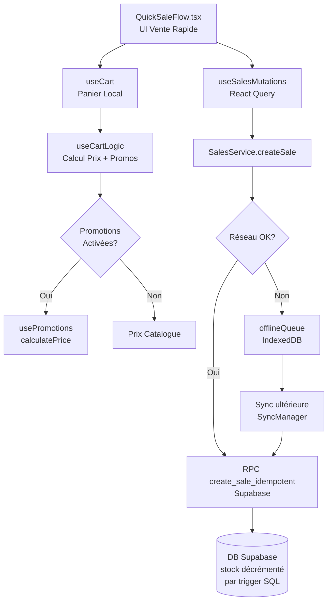
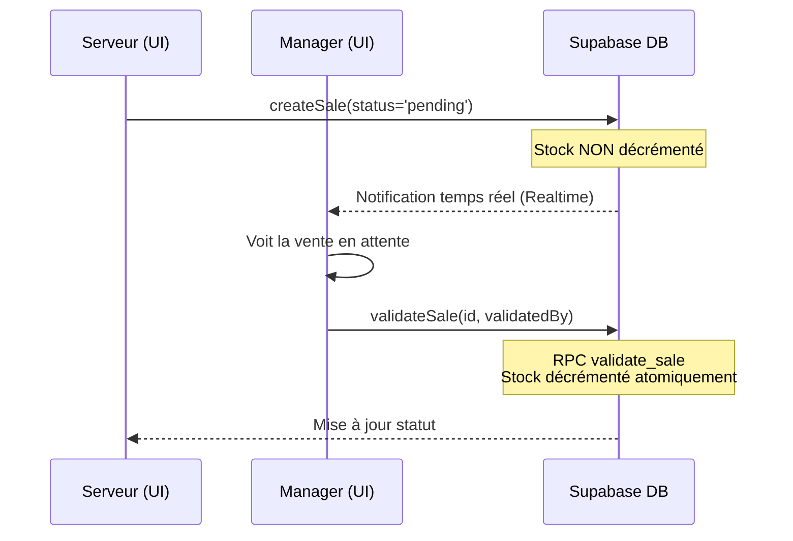

# 📊 Rapport d'Analyse Expert — Processus de Vente BarTender

> **Analyste :** Dev Lead Senior  
> **Date :** 18 Février 2026  
> **Scope :** Processus de vente complet (vente directe, vente serveur, tickets/bons, stocks, offline)  
> **Fichiers analysés :** `sales.service.ts`, `tickets.service.ts`, `stock.service.ts`, `server-mappings.service.ts`, `offlineQueue.ts`, `QuickSaleFlow.tsx`, `useCartLogic.ts`, `useSalesMutations.ts`, `useOrderDraft.ts`

---

## 1. Vue d'Ensemble de l'Architecture



---

## 2. Processus de Vente Directe (Manager / Gérant)

### 2.1 Flux Technique

1. **UI** : `QuickSaleFlow.tsx` — modal plein écran, grille produits + panier sidebar
2. **Panier** : `useCart` → `useCartLogic` → calcul des prix avec promotions via `usePromotions`
3. **Checkout** : `handleCheckout()` → `useSalesMutations.createSale.mutateAsync()`
4. **Statut** : Si rôle `gerant`, `super_admin` ou `promoteur` → statut **`validated`** automatique
5. **Stock** : Décrémenté atomiquement côté SQL via le RPC `create_sale_idempotent`

### 2.2 Points Forts ✅

| Point | Détail |
|-------|--------|
| **Idempotence** | Chaque vente génère un `idempotencyKey` (UUID) → zéro doublon même en cas de retry |
| **Atomicité** | Le RPC SQL gère en une transaction : insertion vente + décrémentation stock |
| **Timeout double** | Timeout 5s dans `SalesService` + timeout 15s dans `useSalesMutations` |
| **Validation Zod** | `validateAndNormalizeSaleItems()` filtre les items invalides avant envoi |
| **Business Date** | Calcul correct de la date métier selon l'heure de fermeture du bar |
| **Keyboard shortcuts** | `Ctrl+Enter` pour valider, `Escape` pour vider/fermer |

### 2.3 Problèmes Identifiés ⚠️

> [!WARNING]
> **BUG #1 — Double log redondant (ligne 170-175 `useSalesMutations.ts`)**  
> ```typescript
> console.log('[useSalesMutations] payload prepared for SalesService:', {...})
> console.log('[useSalesMutations] payload prepared', salePayload); // DOUBLON
> ```
> Pollution des logs en production. À supprimer.

> [!WARNING]
> **BUG #2 — `alert()` natif dans `QuickSaleFlow.tsx` (lignes 143, 148, 193)**  
> ```typescript
> alert(`Serveur inconnu: ${serverNameToCheck}`);
> alert('Erreur lors de la résolution du serveur');
> alert(error instanceof Error ? error.message : 'Erreur vente');
> ```
> Utilisation de `alert()` bloquant au lieu de `toast.error()`. Incohérent avec le reste de l'app.

> [!CAUTION]
> **BUG #3 — `confirm()` natif pour vider le panier (lignes 228, 351)**  
> ```typescript
> if (confirm('Vider le panier ?')) clearCart()
> if (confirm('Vider ?')) clearCart()
> ```
> Bloque le thread UI. Doit être remplacé par une modale de confirmation.

> [!NOTE]
> **RISQUE #4 — `canWorkOffline: !!role`**  
> Si `currentSession` est null (race condition auth), `role` est undefined → `!!role = false` → la vente échoue silencieusement au lieu de basculer en offline. Devrait être `canWorkOffline: true` ou géré explicitement.

---

## 3. Processus de Vente par Serveur + Validation Manager

### 3.1 Flux Technique



### 3.2 Mode Simplifié (Simplified Mode)

- Le manager voit une liste de serveurs (noms) → `ServerMappingsService` résout le nom → UUID
- Cache offline des mappings via `OfflineStorage.getMappings(barId)` avec timeout 3s
- Auto-population des mappings depuis les membres du bar avec rôle `serveur`

### 3.3 Points Forts ✅

| Point | Détail |
|-------|--------|
| **Séparation des rôles** | Serveur crée en `pending`, manager valide → stock décrémenté seulement à la validation |
| **RPC atomique** | `validate_sale` et `reject_sale` sont des RPCs SQL → pas de race condition possible |
| **Fallback cache** | Résolution nom→UUID avec cache local si réseau indisponible |
| **Broadcast** | `BroadcastService` notifie les autres onglets après validation |

### 3.4 Architecture Offline : Conception Intentionnelle ✅

> [!NOTE]
> **CLARIFICATION IMPORTANTE — Le blocage des serveurs en offline est un choix de conception délibéré et bien implémenté.**

Le système implémente une **politique de résilience à deux niveaux** :

| Rôle | Mode Normal | Mode Offline |
|------|-------------|---------------|
| **Gérant / Promoteur** | Ventes validées directement | ✅ Peut vendre en mode simplifié (ventes offline validées) |
| **Serveur** | Ventes en `pending` (validation manager requise) | 🚫 Bloqué — connexion requise |

**Preuves dans le code :**

1. **`OfflineBanner.tsx` ligne 60** : `const canWorkOffline = isSimplifiedMode && isManagerRole;`  
   → Seuls les gérants/promoteurs en mode simplifié ont le droit de travailler hors ligne.

2. **`OfflineBanner.tsx` lignes 143-151** : Le serveur voit un message explicite :  
   *"🚨 Votre rôle de Serveur nécessite une connexion active pour garantir l'intégrité des opérations."*

3. **`AppProvider.tsx` lignes 120-128** : En mode simplifié, un serveur qui tente d'ajouter au panier reçoit un toast bloquant et la fonction retourne immédiatement.

4. **`QuickSaleFlow.tsx` lignes 245-247** : Le composant de vente rapide retourne `null` pour les serveurs en mode simplifié.

**Pourquoi ce choix est correct :** Une vente serveur nécessite une validation manager. En offline, cette validation ne peut pas avoir lieu en temps réel. Forcer le serveur à passer en ligne garantit l'intégrité du flux de validation et évite les ventes fantômes non validées.

**Recommandation opérationnelle documentée :** L'`OfflineBanner` conseille explicitement au gérant de passer en mode simplifié si la connexion est perdue, centralisant ainsi toutes les opérations sur un seul appareil.

> [!WARNING]
> **RISQUE #6 — Pas de notification post-sync pour les ventes `pending` synchronisées**  
> Quand le réseau revient et que le `SyncManager` synchronise les ventes offline du gérant, il n'y a pas de mécanisme d'alerte visible pour confirmer que la synchronisation a bien eu lieu et combien de ventes ont été envoyées. Le toast "Connexion rétablie • Synchronisé" (`OfflineBanner.tsx` ligne 26) est générique et n'indique pas le nombre d'opérations synchronisées.

---

## 4. Gestion des Tickets et Bons

### 4.1 Modèle de Données

```typescript
interface TicketRow {
  id: string;
  bar_id: string;
  status: 'open' | 'paid';  // Seulement 2 états
  created_by: string;
  server_id: string | null;
  ticket_number: number;    // Auto-incrémenté côté SQL
  table_number: number | null;
  customer_name: string | null;
  paid_at: string | null;
  paid_by: string | null;
  payment_method: string | null;
}
```

### 4.2 Flux Ticket

1. **Création** : `TicketsService.createTicket()` → RPC `create_ticket` (avec `closing_hour` pour la date métier)
2. **Ajout de ventes** : Ventes liées au ticket via `ticket_id` dans la table `sales`
3. **Paiement** : `TicketsService.payTicket()` → RPC `pay_ticket` → statut `paid`
4. **Offline** : Création et paiement de tickets supportés en offline via `offlineQueue`

### 4.3 Points Forts ✅

| Point | Détail |
|-------|--------|
| **Idempotence** | UUID généré avant chaque opération |
| **Offline complet** | Création ET paiement de tickets fonctionnent hors ligne |
| **Optimistic UI** | Ticket optimiste retourné immédiatement avec `isOptimistic: true` |
| **Numéro de table** | Support du numéro de table et du nom client |

### 4.4 Problèmes Identifiés ⚠️

> [!CAUTION]
> **BUG #8 — `payTicket()` offline retourne un objet partiel (ligne 119)**  
> ```typescript
> return { id: ticketId, status: 'paid', paid_by: paidBy, payment_method: paymentMethod } as any;
> ```
> Le cast `as any` masque le fait que l'objet retourné est incomplet (manque `bar_id`, `created_by`, `ticket_number`, etc.). Cela peut causer des crashes dans les composants qui consomment ce retour.

> [!WARNING]
> **RISQUE #9 — Pas de statut intermédiaire pour les tickets**  
> Le ticket n'a que 2 états : `open` / `paid`. Il manque un état `partially_paid` ou `in_progress` pour les tables qui ont commandé mais pas encore payé. Cela limite les cas d'usage (ex: paiement partiel, addition séparée).

> [!NOTE]
> **RISQUE #10 — `getOpenTickets()` sans pagination**  
> ```typescript
> static async getOpenTickets(barId: string): Promise<TicketRow[]>
> ```
> Charge tous les tickets ouverts sans limite. Pour un bar très actif avec beaucoup de tables, cela peut devenir un problème de performance.

---

## 5. Décrémentation des Stocks

### 5.1 Architecture

La décrémentation est **entièrement gérée côté SQL** via des RPCs `SECURITY DEFINER` :

| RPC | Déclencheur | Action Stock |
|-----|-------------|--------------|
| `create_sale_idempotent` | Vente validée directement | Décrémente |
| `validate_sale` | Validation manager | Décrémente |
| `reject_sale` | Rejet manager | Restaure (si déjà décrémenté) |
| `cancel_sale` | Annulation | Restaure |
| `create_supply_and_update_product` | Approvisionnement | Incrémente |

### 5.2 Points Forts ✅

| Point | Détail |
|-------|--------|
| **Atomicité totale** | Jamais de décrémentation partielle — tout ou rien |
| **Traçabilité complète** | Timeline produit : ventes, approvisionnements, consignations, ajustements, retours |
| **Sécurité** | RPCs `SECURITY DEFINER` → les règles métier ne peuvent pas être contournées côté client |
| **Gestion des échanges** | `source_return_id` tracé pour les ventes issues d'échanges |

### 5.3 Problèmes Identifiés ⚠️

> [!CAUTION]
> **BUG #11 — Stock offline non décrémenté visuellement**  
> Quand une vente est mise en queue offline, le stock affiché dans l'UI n'est pas décrémenté localement. L'utilisateur peut donc vendre le même produit plusieurs fois hors ligne sans avertissement de rupture de stock.

> [!WARNING]
> **RISQUE #12 — `createConsignment()` sans RPC (ligne 135-148 `stock.service.ts`)**  
> ```typescript
> const { data: newConsignment, error } = await supabase
>   .from('consignments')
>   .insert(data)
>   .select()
>   .single();
> ```
> La création de consignation passe par un insert direct (pas de RPC). Si la décrémentation du stock est gérée par un trigger, c'est acceptable. Sinon, il y a un risque de désynchronisation stock/consignation.

> [!NOTE]
> **RISQUE #13 — `batchUpsertSupplies()` avec `unit_cost: 0` (ligne 188)**  
> ```typescript
> unit_cost: 0,
> total_cost: 0,
> ```
> L'initialisation du stock lors de l'onboarding crée des approvisionnements avec coût zéro. Cela fausse les calculs de marge et de coût de revient dans les analytics.

---

## 6. File d'Attente Offline (OfflineQueue)

### 6.1 Architecture IndexedDB

```
bartender_offline_queue (v3)
├── sync_operations      → Opérations en attente (CREATE_SALE, CREATE_TICKET, PAY_TICKET...)
├── id_translations      → Mapping tempId → realId (après sync)
└── transitional_syncs   → Buffer anti-flash (TTL 10min)
```

### 6.2 Points Forts ✅

| Point | Détail |
|-------|--------|
| **Validation Zod** | Chaque payload validé par `MutationSchemas[type]` avant insertion |
| **Timeout adaptatif** | 5s desktop, 15s mobile/2G |
| **Quota protection** | Nettoyage auto des opérations >7 jours si `QuotaExceededError` |
| **Anti-HMR** | Singleton global `__OFFLINE_QUEUE_INSTANCE__` évite les zombies en dev |
| **Multi-onglets** | Gestion `onblocked` et `onversionchange` pour éviter la corruption |
| **Transitional buffer** | Évite le "flash" de disparition des ventes pendant la synchronisation |

### 6.3 Problèmes Identifiés ⚠️

> [!CAUTION]
> **BUG #14 — Zombie instance non fermée (lignes 551-559)**  
> ```typescript
> if ((window as any)[globalKey]) {
>   try {
>     // Note: OfflineQueue n'expose pas close() publiquement...
>   } catch (e) { ... }
> }
> ```
> Le commentaire lui-même admet que la fermeture de l'instance zombie ne fonctionne pas. La méthode `close()` existe (ligne 535) mais est appelée `close()` — elle devrait être exposée publiquement et appelée ici.

> [!WARNING]
> **RISQUE #15 — Pas de limite de retry configurable**  
> `retryCount` est incrémenté mais il n'y a pas de logique de `maxRetries` dans `OfflineQueue` lui-même. La logique de retry est dans `SyncManager`. Si `SyncManager` est buggé, les opérations peuvent boucler indéfiniment.

> [!NOTE]
> **RISQUE #16 — `discount_total: 0` pour les ventes offline (ligne 223)**  
> ```typescript
> discount_total: 0, // Pas de remise pour les ventes offline (pour l'instant)
> ```
> Les promotions ne sont pas appliquées aux ventes offline. Un client peut bénéficier d'une promotion en ligne mais pas hors ligne. Incohérence métier à documenter clairement.

---

## 7. Promotions Appliquées à la Vente

### 7.1 Flux

```
useCart → useCartLogic → usePromotions.calculatePrice(product, quantity)
                              ↓
                    Meilleure promotion applicable
                    (bundle, fixed_discount, percentage, special_price)
                              ↓
                    CalculatedItem { unit_price, discount_amount, promotion_id }
                              ↓
                    useSalesMutations → SalesService (items avec promotion_id)
```

### 7.2 Points Forts ✅

- Calcul automatique de la meilleure promotion (`PROMOTIONS_AUTO_APPLY`)
- Traçabilité complète : `promotion_id`, `promotion_name`, `discount_amount` stockés par item
- Feature flag `FEATURES.PROMOTIONS_AUTO_APPLY` pour désactiver sans déploiement

### 7.3 Problèmes Identifiés ⚠️

> [!WARNING]
> **RISQUE #17 — Promotions non appliquées en mode offline**  
> Comme mentionné en §6.3, `discount_total: 0` en offline. Les promotions calculées côté client ne sont pas persistées dans le payload offline. À la synchronisation, la vente est créée sans promotion.

---

## 8. Tableau de Synthèse

### 8.1 Bugs Critiques (à corriger immédiatement)

| # | Fichier | Sévérité | Description |
|---|---------|----------|-------------|
| 11 | `offlineQueue.ts` | 🔴 CRITIQUE | Stock non décrémenté visuellement en offline (gérant) |
| 8 | `tickets.service.ts:119` | 🟠 MAJEUR | `payTicket()` offline retourne objet partiel avec `as any` |
| 14 | `offlineQueue.ts:551` | 🟠 MAJEUR | Instance zombie non fermée en HMR |

> [!NOTE]
> **Bug #5 annulé** : Le statut `validated` dans `mapOperationToOfflineSale()` est correct par construction — seuls les gérants/promoteurs peuvent créer des ventes offline (les serveurs sont bloqués). Les ventes offline sont donc toujours des ventes de gérant → statut `validated` est légitime.

### 8.2 Bugs Importants (à planifier)

| # | Fichier | Sévérité | Description |
|---|---------|----------|-------------|
| 2 | `QuickSaleFlow.tsx:143,148,193` | 🟡 MOYEN | `alert()` natif au lieu de `toast.error()` |
| 3 | `QuickSaleFlow.tsx:228,351` | 🟡 MOYEN | `confirm()` natif bloquant |
| 1 | `useSalesMutations.ts:175` | 🟢 MINEUR | Log dupliqué |
| 13 | `stock.service.ts:188` | 🟡 MOYEN | `unit_cost: 0` à l'onboarding fausse les marges |

### 8.3 Risques Architecturaux

| # | Risque | Impact | Recommandation |
|---|--------|--------|----------------|
| 4 | `canWorkOffline: !!role` | Vente perdue si session null | Utiliser `canWorkOffline: true` |
| 6 | Pas de notif post-sync pour ventes pending | Manager manque des validations | Ajouter alerte post-sync |
| 9 | Pas d'état `partially_paid` sur tickets | Limitation métier | Ajouter état intermédiaire |
| 10 | `getOpenTickets()` sans pagination | Performance sur gros volumes | Ajouter `limit` par défaut |
| 16 | Promotions non appliquées offline | Incohérence client | Sérialiser les promotions dans le payload offline |
| 17 | Idem | Idem | Idem |

---

## 9. Recommandations Prioritaires

### 🔴 Sprint Immédiat (Semaine 1)

1. **Décrémentation optimiste du stock** : Après une vente offline d'un gérant, décrémenter le stock dans le cache React Query local pour éviter les surventes sur le même appareil
2. **Remplacer `alert()`/`confirm()`** par des toasts et modales de confirmation dans `QuickSaleFlow.tsx`
3. **Notification de sync détaillée** : Après reconnexion, afficher le nombre d'opérations synchronisées (pas juste "Connexion rétablie")

### 🟠 Sprint Court (Semaine 2-3)

4. **Corriger `payTicket()` offline** : Retourner un `TicketRow` complet avec les valeurs par défaut
5. **Fermer l'instance zombie** : Exposer `close()` publiquement dans `OfflineQueue` et l'appeler dans le bloc HMR
6. **Notification post-sync** : Alerter le manager quand des ventes `pending` sont synchronisées

### 🟡 Backlog (Mois 1)

7. **Promotions offline** : Sérialiser la promotion calculée dans le payload `offlineQueue` pour la conserver à la synchronisation
8. **Pagination des tickets** : Ajouter un `limit` par défaut à `getOpenTickets()`
9. **Coûts onboarding** : Permettre la saisie du coût unitaire lors de l'initialisation du stock
10. **État ticket intermédiaire** : Envisager `in_progress` pour les tables actives

---

## 10. Verdict Global

> [!IMPORTANT]
> **L'architecture du processus de vente est globalement solide et bien pensée.** Les choix techniques (RPC idempotents, IndexedDB, React Query, Zod, dual-casing) témoignent d'une maturité technique réelle. La politique de résilience offline — bloquer les serveurs, autoriser uniquement les gérants en mode simplifié — est un choix de conception **intentionnel, cohérent et bien implémenté** à tous les niveaux (UI, service, banner).
>
> Les bugs identifiés sont principalement des **bugs de surface** (alert/confirm natifs) et des **lacunes UX mineures** (feedback post-sync). Aucun bug de sécurité critique n'a été identifié dans ce processus.
>
> **Score de maturité révisé : 8/10** — Architecture robuste, prête pour la production avec les corrections du Sprint Immédiat.
